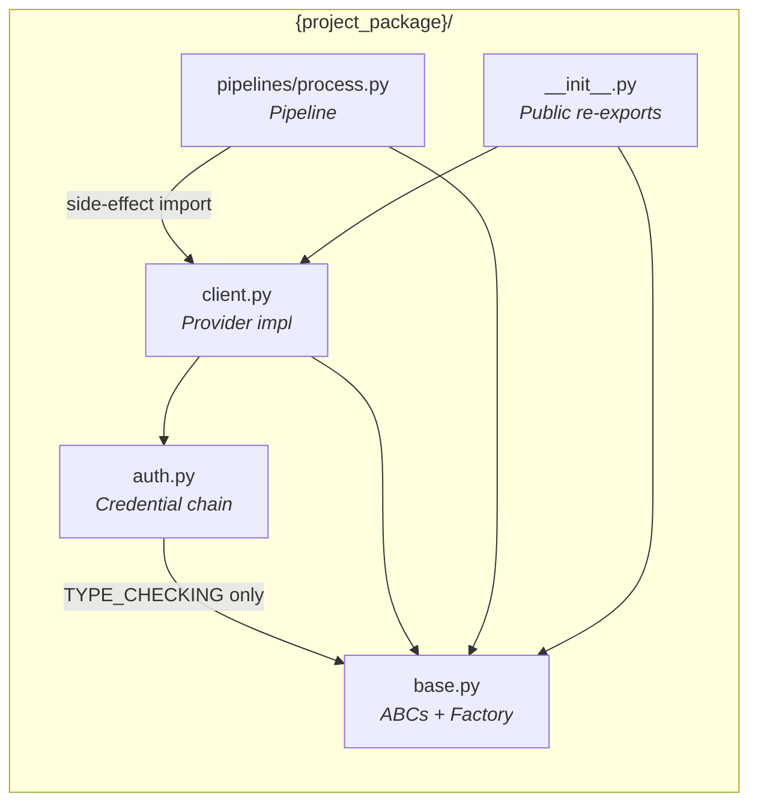
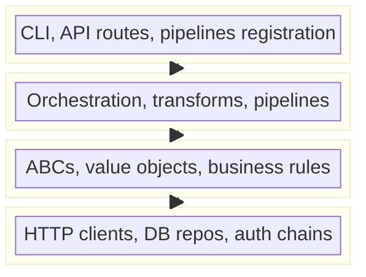
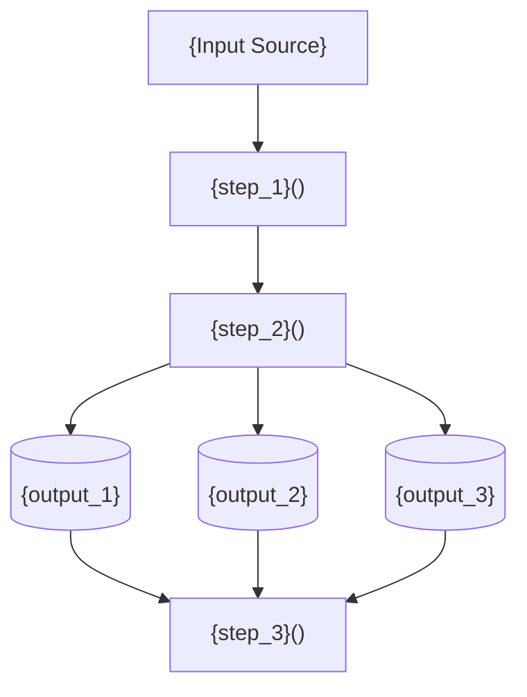
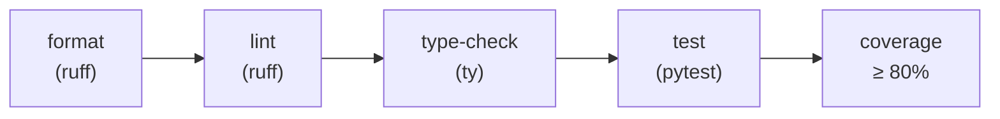

# {Project Name} — Specifications

> [!NOTE]
> **Spec-Driven Development (SDD) Template — v1.0.0**
>
> **How to use this template**
> 1. Copy this file to your project root as `SPECIFICATIONS.md`.
> 2. Replace every `{PLACEHOLDER}` with your project-specific values.
> 3. Fill every `<!-- FILL: ... -->` section. Delete the comment when done.
> 4. Sections marked ★ PRE-FILLED are ready to use — edit only if your tooling differs.
> 5. Feed the completed spec to Claude Opus 4.6 as the primary context for every implementation prompt.

> [!IMPORTANT]
> **The Contract** — This spec IS the source of truth. Code that contradicts the spec is a bug. A spec that contradicts reality must be updated first, then the code changed to match.

> [!TIP]
> **RFC-2119 Language**
> - **"shall" / "must"** = mandatory requirement (test must verify it)
> - **"should"** = strong recommendation (deviation needs justification)
> - **"may"** = optional (nice to have)

> **Version:** {0.1.0}  
> **Status:** Draft | In Review | Final  
> **Authors:** {Author 1}, {Author 2}  
> **License:** {Proprietary — Your Organization | MIT | Apache-2.0}

---

## Table of Contents

0. [AI Steering Preamble](#0-ai-steering-preamble)
1. [Introduction](#1-introduction)
2. [Goals & Non-Goals](#2-goals--non-goals)
3. [System Context & Dependencies](#3-system-context--dependencies)
4. [Architecture Overview](#4-architecture-overview)
5. [Module Specifications](#5-module-specifications)
6. [Configuration Specification](#6-configuration-specification)
7. [Data Flow & Processing Specification](#7-data-flow--processing-specification)
8. [Output Specification](#8-output-specification)
9. [Error Handling Specification](#9-error-handling-specification)
10. [Observability Specification](#10-observability-specification)
11. [Memory & Performance Specification](#11-memory--performance-specification)
12. [Security Specification](#12-security-specification)
13. [Extensibility Specification](#13-extensibility-specification)
14. [Backward Compatibility Specification](#14-backward-compatibility-specification)
15. [Testing Specification](#15-testing-specification) ★ PRE-FILLED
16. [Build, Tooling & Quality Specification](#16-build-tooling--quality-specification) ★ PRE-FILLED
17. [Documentation Specification](#17-documentation-specification) ★ PRE-FILLED

---

## 0. AI Steering Preamble

<!--
This section is consumed by the AI agent (Claude Opus 4.6) before it writes
a single line of code. It establishes the persona, the quality bar, the style
rules, and the hard constraints. It acts as a persistent "system prompt" that
never drifts between conversations.

DO NOT DELETE THIS SECTION. Refine it to match your organization's standards.
-->

### 0.1 AI Persona & Quality Bar

You are a **Staff Software Engineer** implementing this specification. Your code shall:

- Be **production-grade** — no TODOs, no placeholder logic, no "exercise left to the reader".
- Read like a **well-edited technical book** — clear naming, single responsibility, minimal comments (the code *is* the comment).
- Demonstrate **mastery of Python idioms** — dataclasses, protocols, context managers, generators, `__all__` exports, `__slots__` where beneficial.
- Treat every public symbol as a **published API** — stable signatures, complete docstrings, defensive input validation.
- Prefer **composition over inheritance** unless the spec explicitly prescribes a class hierarchy.

### 0.2 Language Conventions (RFC-2119)

Throughout this specification:

| Keyword | Meaning |
|---------|---------|
| **shall** / **must** | Absolute requirement. A test **must** verify compliance. |
| **shall not** / **must not** | Absolute prohibition. |
| **should** | Strong recommendation. Deviation requires written justification in a code comment. |
| **may** | Truly optional. |

### 0.3 Code Style Mandate

Every source file **shall** comply with:

| Rule | Requirement |
|------|-------------|
| **Future annotations** | `from __future__ import annotations` as the first code line (after the copyright header). |
| **Type hints** | All function signatures, all class attributes, all return types. Use PEP 604 unions (`X \| Y`), not `Optional[X]`. |
| **Docstrings** | Google style. Every public class, method, and function. Include `Args:`, `Returns:`, `Raises:` sections. |
| **`__all__`** | Every module **shall** declare `__all__` to make the public API explicit. |
| **Imports** | stdlib → third-party → first-party, separated by blank lines. Enforced by `ruff` isort rules. |
| **Logging** | `logging.getLogger(__name__)`. Never `print()`. Never log secrets. |
| **Constants** | Module-level `UPPER_SNAKE_CASE`. Never magic numbers/strings in function bodies. |
| **Copyright header** | Every `.py` file **shall** begin with the organization's copyright header. |

### 0.4 Forbidden Anti-Patterns

The AI **shall not** generate code that contains any of the following:

| Anti-Pattern | Why It's Forbidden |
|--------------|--------------------|
| `# type: ignore` without a bracketed error code and comment | Suppresses real bugs. If needed: `# type: ignore[override] — parent uses Any`. |
| Bare `except:` or `except Exception:` that swallows silently | Hides bugs. Always log or re-raise. |
| Mutable default arguments (`def f(x=[])`) | Classic Python footgun. Use `None` + internal creation or `field(default_factory=...)`. |
| `from module import *` | Pollutes namespace, breaks `__all__` contracts. |
| Global mutable state (module-level dicts/lists modified at runtime) | Unless it's a **registry pattern** explicitly required by the spec. |
| Hard-coded secrets, URLs, or file paths | Must come from config, environment, or secret stores. |
| `time.sleep()` in production code | Use `tenacity` or async waits for retries. |
| Classes with both `@staticmethod` and instance state | Indicates confused design. Pick one responsibility. |
| God classes (> 300 lines or > 7 public methods) | Split into collaborators. |
| Nested functions deeper than 2 levels | Extract to named private functions or classes. |
| Comments that repeat the code (`# increment x` above `x += 1`) | Comments explain *why*, code explains *what*. |
| Dead code left in "just in case" | Version control exists. Delete it. |

### 0.5 Design Pattern Selection Guide

When implementing a feature, select from this catalog. **Document which pattern you chose in the module docstring.**

| Pattern | When to Use | Python Idiom |
|---------|-------------|--------------|
| **Strategy** | Multiple interchangeable algorithms behind a common interface | ABC + concrete subclasses, or `Protocol` |
| **Factory + Registry** | Creating objects by key without hard-coding imports | `ClassVar[dict]` + `@classmethod` decorator |
| **Template Method** | Fixed lifecycle with customizable steps | ABC with concrete + abstract methods |
| **Chain of Responsibility** | Ordered fallback/pipeline processing | Linked handlers with `set_next()` |
| **Repository** | Decoupling data access from business logic | ABC with `read()` / `write()` |
| **Adapter** | Wrapping a third-party SDK behind your own interface | Thin wrapper class |
| **Observer / Event** | Decoupled notification of state changes | Callback lists or `signal` libraries |
| **Builder** | Complex object construction with many optional params | Fluent API or `@dataclass` + `from_dict()` |
| **Decorator** | Adding behavior without modifying a class | `functools.wraps` wrapper or class decorator |
| **Singleton / Borg** | Exactly one instance (e.g., connection pool) | Module-level instance or `__new__` override |

---

## 1. Introduction

<!--
FILL: One paragraph describing what this project does and its role in the
larger system. Use present tense. Be specific — "processes X for Y" not
"does stuff".
-->

**{Project Name}** is a Python library that {brief description of what the project does}. It **shall** operate as {standalone library / CLI tool / pipeline plugin / microservice}.

### 1.1 Scope

This document specifies the functional and non-functional requirements for:

<!-- FILL: Bulleted list of 3–6 top-level capabilities this spec covers. -->
- {Capability 1 — e.g., "A provider-agnostic abstraction layer for X"}
- {Capability 2 — e.g., "A concrete implementation for Provider Y"}
- {Capability 3 — e.g., "A retry-resilient client with credential resolution"}
- {Capability 4 — e.g., "A data pipeline that reads, transforms, and writes"}

### 1.2 Definitions

<!-- FILL: Add every domain-specific term a new team member would need. -->

| Term | Definition |
|------|-----------|
| **{Term 1}** | {Definition} |
| **{Term 2}** | {Definition} |
| **{Term 3}** | {Definition} |

---

## 2. Goals & Non-Goals

### 2.1 Goals

<!-- FILL: Each goal gets a stable ID (G-N). Be concrete and testable. -->

| ID | Goal |
|----|------|
| G-1 | {Provide a **provider-agnostic** interface for X so downstream code is decoupled from vendors} |
| G-2 | {Ship a **production-ready** integration with Provider Y} |
| G-3 | {Ensure **no sensitive data leakage** — secrets excluded from serialization and logs} |
| G-4 | {Be usable as both a **standalone library** and a **plugin** via FactoryZ} |

### 2.2 Non-Goals

<!-- FILL: Explicitly state what this project does NOT do. Prevents scope creep. -->

| ID | Non-Goal |
|----|----------|
| NG-1 | {This library shall **not** implement its own ML model — it delegates to external providers} |
| NG-2 | {Pipeline orchestration and scheduling are **not** in scope} |
| NG-3 | {Real-time / streaming processing is **not** in scope — batch mode only} |

---

## 3. System Context & Dependencies

### 3.1 Runtime Requirements

| Requirement | Specification |
|-------------|--------------|
| **Python** | ≥ 3.11, < 3.15 |
| **OS** | {Linux, macOS — specify if Windows is excluded} |

<!-- FILL: Add any other runtime requirements (Java version for Spark, Node.js, etc.) -->

### 3.2 Package Dependencies

<!--
FILL: Every direct dependency, its version constraint, and why it exists.
The AI uses this to generate correct import statements and pyproject.toml.
-->

| Package | Version Constraint | Purpose |
|---------|-------------------|---------|
| `{package-1}` | `>={x.y.z}` | {Why this package is needed} |
| `{package-2}` | `>={x.y.z}, <{a.b.c}` | {Why} |
| `tenacity` | `>=9.1.4` | Retry with exponential backoff |

### 3.3 Optional Dependencies

| Package | Purpose |
|---------|---------|
| `python-dotenv` | `.env` file loading (optional) |

### 3.4 External Systems & APIs

<!--
FILL: Every external system this code talks to. Include auth method.
Leave empty if the library is self-contained.
-->

| System | Protocol | Auth Method | Timeout |
|--------|----------|-------------|---------|
| {Private AI API} | HTTPS | Bearer token | 30s |

---

## 4. Architecture Overview

### 4.1 Design Patterns Applied

<!--
FILL: Map each pattern from Section 0.5 to the module that uses it.
This table is the architectural blueprint the AI follows.
-->

| Pattern | Where Applied |
|---------|--------------|
| **{Strategy}** | {`base.py` — each provider is a pluggable strategy behind the `Client` interface} |
| **{Factory + Registry}** | {`base.py` — `ClientFactory` registers and creates `Client`/`Config` pairs by key} |
| **{Chain of Responsibility}** | {`auth.py` — credential resolution through ordered fallback handlers} |
| **{Template Method}** | {`pipelines/process.py` — `Pipeline` extends lifecycle: read → transform → write} |

### 4.2 Module Dependency Graph

<!--
FILL: Mermaid diagram showing every module and the direction of imports.
The AI uses this to avoid circular dependencies.
-->



### 4.3 Dependency Flow Rules

The dependency flow **shall** be strictly:

<!-- FILL: Define the import DAG. No cycles allowed. -->

- `base.py` → **no** internal imports
- `auth.py` → `base.py` (`TYPE_CHECKING` only)
- `client.py` → `base.py`, `auth.py`
- `pipelines/*.py` → `base.py`, `client.py` (side-effect import for registration)

### 4.4 Layered Architecture

<!--
FILL: If your project has clear layers, define them here.
Delete this subsection if not applicable.
-->



---

## 5. Module Specifications

> [!IMPORTANT]
> **How to write module specs** — For EACH module, create a subsection (5.N) with:
> 1. `SPEC-{MOD}-NNN` numbered requirements (e.g., `SPEC-BASE-001`).
> 2. A class/dataclass **field table**: field | type | default | description.
> 3. A **method table**: method | signature | description.
> 4. **Error behavior**: what exceptions are raised and when.
> 5. **Invariants**: what must always be true (e.g., "frozen dataclass").
>
> This is the section where you invest the most time. The AI produces code that is a 1:1 map of these tables.

### 5.1 `{module_name}` — {Human-Readable Description}

#### SPEC-{MOD}-001: `{ClassName}` {dataclass | ABC | class}

The system **shall** provide a `{ClassName}` {dataclass | abstract base class | class} with the following fields:

| Field | Type | Default | Description |
|-------|------|---------|-------------|
| `{field_1}` | `str` | *(required)* | {What this field represents} |
| `{field_2}` | `int` | `0` | {What this field represents} |
| `{field_3}` | `list[str] \| None` | `None` | {What this field represents} |

<!-- Add as many SPEC-{MOD}-NNN blocks as needed per module. -->

#### SPEC-{MOD}-002: `{ClassName}` methods

The system **shall** provide the following methods:

| Method | Signature | Description |
|--------|-----------|-------------|
| `{method_1}` | `(arg: str) → Result` | {What it does} |
| `{method_2}` | `(items: list[str]) → list[Result]` | {What it does} |

Error behavior:
- `{method_1}` **shall** raise `ValueError` if {condition}.
- `{method_2}` **shall** raise `KeyError` if {condition}.

<!--
REPEAT subsection 5.N for every module in your project.
Copy the template block above.
-->

### 5.2 `{next_module}` — {Description}

<!-- FILL: Continue with SPEC-{MOD}-NNN blocks for each module. -->

---

## 6. Configuration Specification

### 6.1 Configuration Format

<!--
FILL: Define what your config looks like (YAML, TOML, env vars, dataclass).
Include an example.
-->

The system **shall** accept configuration via {YAML file | environment variables | `pyproject.toml` | dataclass constructor}:

```yaml
# Example configuration structure
{config_key}:
  {field_1}: {value}           # Required. {Description}.
  {field_2}: [{value}, ...]    # Required. {Description}.
  {nested_section}:            # Required.
    provider: {string}         # Optional (defaults to "{default_provider}").
    url: {string}              # Required.
```

### 6.2 Validation Rules

<!-- FILL: Every validation that shall run before processing starts. -->

| Validation | Error | Message Pattern |
|------------|-------|-----------------|
| `{config_key}` section present | `ValueError` | `"missing required '{config_key}'"` |
| `{field_1}` present and non-empty | `ValueError` | `"missing '{field_1}'"` |

### 6.3 Legacy Configuration Support

<!--
FILL: If you need backward-compatible config key migration, define it here.
Delete this subsection if not applicable.
-->

| Scenario | Behavior |
|----------|----------|
| Legacy key `{old_key}` present, new key `{new_key}` absent | Promote `{old_key}` with `provider: "{default}"`. Emit `DeprecationWarning`. |
| Both present | `{new_key}` takes precedence. |

---

## 7. Data Flow & Processing Specification

### 7.1 End-to-End Flow

<!-- FILL: Mermaid diagram showing the complete data flow. -->



### 7.2 Data Schemas

<!-- FILL: Define the shape of data at each stage. -->

**Input schema:**

| Column / Field | Type | Description |
|---------------|------|-------------|
| `{field}` | `string` | {Description} |

**Output schema:**

| Column / Field | Type | Description |
|---------------|------|-------------|
| `{field}` | `string` | {Description} |

---

## 8. Output Specification

<!-- FILL: For each output artifact, specify columns, rows, and constraints. -->

### 8.1 {Output Name 1} (e.g., primary result)

| Content | Specification |
|---------|--------------|
| Columns | {List of columns} |
| Rows | {What rows are included/excluded} |
| Constraints | {e.g., "original PII column shall be dropped"} |

### 8.2 {Output Name 2} (e.g., metadata)

| Content | Specification |
|---------|--------------|
| Columns | {List of columns} |
| Rows | {What rows are included/excluded} |

### 8.3 {Output Name 3} (e.g., dead-letter queue)

| Content | Specification |
|---------|--------------|
| Columns | {List of columns, including error info} |
| Rows | {Only rows where processing failed} |
| Purpose | {Failed rows can be reprocessed after fixing the root cause} |

---

## 9. Error Handling Specification

### 9.1 Error Taxonomy

<!--
FILL: Enumerate every error category, how it's handled, and the retry policy.
The AI uses this to generate try/except blocks and fallback logic.
-->

| Category | Behavior | Retry Policy |
|----------|----------|--------------|
| **Transient network failure** | Retry with exponential backoff | Up to `max_retries` times, backoff `min(base × 2^attempt, 30s)` |
| **Batch processing failure** | Fall back to row-by-row processing | Per-item errors isolated |
| **Configuration validation** | Raise `ValueError` immediately | No retry |
| **Authentication failure** | Chain of handlers; return `None` if all fail | Per-handler, no cross-handler retry |

### 9.2 Exception Hierarchy

<!--
FILL: Define any custom exceptions your project needs.
-->

```python
class {ProjectName}Error(Exception):
    """Base exception for all {project} errors."""

class ConfigurationError({ProjectName}Error, ValueError):
    """Raised when configuration validation fails."""

class ProviderError({ProjectName}Error):
    """Raised when an external provider call fails after all retries."""
```

### 9.3 Retry Specification

<!-- FILL: Concrete retry behavior. The AI generates tenacity decorators from this. -->

- Transient failures **shall** be retried up to `max_retries` times.
- Setting `max_retries=0` **shall** disable retries (fire once).
- Backoff **shall** be exponential: `min(retry_backoff_base × 2^attempt, 30)` seconds.
- On final exhaustion, the last exception **shall** be re-raised (loud fail).
- An `ERROR`-level log entry containing `"FATAL"` **shall** be emitted before re-raising.

### 9.4 Fallback Strategy

<!-- FILL: Define any fallback logic (e.g., batch → row-by-row). Delete if not applicable. -->

| Scenario | Behavior |
|----------|----------|
| Batch call succeeds | All results mapped to their respective rows |
| Batch call fails | Fall back to row-by-row calls to isolate individual errors |
| Individual call fails in fallback | Error string recorded; row routed to dead-letter queue |

---

## 10. Observability Specification

### 10.1 Logging Standards

| Requirement | Specification |
|-------------|--------------|
| **Logger creation** | `logger = logging.getLogger(__name__)` in every module |
| **Structured context** | Use `extra={...}` for machine-parseable fields |
| **Secrets** | **Shall never** appear in log messages at any level |
| **Level usage** | `DEBUG` = internal tracing; `INFO` = key lifecycle events; `WARNING` = recoverable issues; `ERROR` = failures requiring attention |

### 10.2 Metrics

<!-- FILL: Define any metrics to emit (counters, histograms, etc.). Delete if not applicable. -->

| Metric | Type | Description |
|--------|------|-------------|
| `{project}_items_processed_total` | Counter | Total items successfully processed |
| `{project}_errors_total` | Counter | Total processing errors |

### 10.3 Health Checks

<!-- FILL: Define any health/readiness checks. Delete if not applicable. -->

---

## 11. Memory & Performance Specification

<!-- FILL: Define memory and performance constraints. Delete items that don't apply. -->

| Requirement | Specification |
|-------------|--------------|
| **SPEC-MEM-001** | {Processing shall use bounded batches — no unbounded `.collect()` calls} |
| **SPEC-MEM-002** | {Intermediate results shall be spilled to disk, not held in heap} |
| **SPEC-MEM-003** | {Output splits shall use lazy evaluation — no eager materialization} |
| **SPEC-PERF-001** | {Single-item latency shall be < {N}ms at p99} |
| **SPEC-PERF-002** | {Batch throughput shall be > {N} items/second} |

---

## 12. Security Specification

<!--
FILL: Define security requirements. These generate concrete code constraints.

Use the checklist below to audit your project for security concerns.
For each item that applies, add a SPEC-SEC-NNN row to the table below.

  SECRET MANAGEMENT
  □ Identify all fields that hold API keys, tokens, or credentials.
  □ Add them to `_SECRETS` so they are excluded from serialization and repr.
  □ Verify credentials are resolved at runtime, never baked into config dicts.

  SOURCE CODE SCAN
  □ No hard-coded secrets, private keys, or certificates in source files.
  □ No hard-coded internal URLs or IP addresses.
  □ No database connection strings with embedded passwords.

  DATA PROTECTION
  □ Identify columns or fields that contain PII or sensitive data.
  □ Specify which sensitive columns shall be dropped from outputs.
  □ Define data classification levels if applicable (public / internal / confidential).

  NETWORK & AUTH
  □ All external endpoints shall use HTTPS — no plain HTTP.
  □ OAuth2 / token endpoints shall enforce a timeout (e.g., 10 seconds).
  □ Bearer tokens shall not be logged at any level.
  □ Authentication tokens shall have bounded lifetimes / be refreshable.

  LOGGING & OBSERVABILITY
  □ Secrets shall never appear in log messages at any level.
  □ `__repr__` shall mask secret fields with "****".
  □ Error messages shall not leak stack traces containing secrets.

  DEPENDENCY SECURITY
  □ Dependencies shall be pinned and audited for known CVEs.
  □ Optional dependencies shall fail gracefully, not expose attack surface.

  SERIALIZATION BOUNDARIES
  □ Config objects crossing process boundaries (Spark executors, HTTP, queues)
    shall strip secrets via `to_serializable_dict()`.
  □ Pickle / JSON serialization shall never include credential fields.
-->

| Requirement | Specification |
|-------------|--------------|
| **SPEC-SEC-001** | Fields listed in `_SECRETS` **shall** be excluded from `to_serializable_dict()` so secrets are never shipped across process boundaries |
| **SPEC-SEC-002** | `__repr__` **shall** mask secret fields with `"****"` (or show `None` if unset) |
| **SPEC-SEC-003** | Credentials **shall** be resolved at runtime (not from serialized config) |
| **SPEC-SEC-004** | {Sensitive data columns shall be dropped from output} |
| **SPEC-SEC-005** | {OAuth2 endpoints shall use HTTPS and have a 10-second timeout} |

---

## 13. Extensibility Specification

### 13.1 Adding a New {Provider / Plugin / Strategy}

<!--
FILL: Step-by-step guide for extending the system. The AI uses this to
verify its Factory/Registry patterns are correct.
-->

To add a new {provider}, implementors **shall**:

1. Create a `{Config}` subclass decorated with `@{Factory}.register_config("{key}")`:
    - Set `provider: ClassVar[str] = "{key}"`.
    - Add sensitive fields to `_SECRETS`.
2. Create a `{Client}` subclass decorated with `@{Factory}.register("{key}")`:
    - Implement `{method_1}(text) → Result`.
    - Implement `{method_2}(texts) → list[Result]`.
3. Ensure the module is imported so the decorators execute (side-effect import).

**No changes to existing code shall be required** (Open-Closed Principle).

### 13.2 Lifecycle Hook Points

<!-- FILL: List any points where subclasses can inject behavior. -->

| Hook | When Called | Override For |
|------|-----------|--------------|
| `before_read()` | Before data ingestion | Validation, setup |
| `after_write()` | After all outputs written | Cleanup, table optimization |

---

## 14. Backward Compatibility Specification

<!-- FILL: Define the public API contract and deprecation strategy. -->

| Requirement | Specification |
|-------------|--------------|
| **SPEC-COMPAT-001** | {Legacy config key `{old}` shall be accepted and auto-promoted} |
| **SPEC-COMPAT-002** | {A `DeprecationWarning` shall be emitted when the legacy key is used} |
| **SPEC-COMPAT-003** | {`Result` shall be re-exported from `{package}.client` for backward-compatible imports} |
| **SPEC-COMPAT-004** | {Public classes shall be re-exported from `{package}.__init__`} |

---

## 15. Testing Specification

<!--
★ PRE-FILLED — This section is ready to use. Adjust thresholds and add
your project-specific test requirements to the table in 15.3.
-->

### 15.1 Test Philosophy

> **If it's in the spec, it has a test. If it doesn't have a test, it doesn't exist.**

- Every `SPEC-*` requirement in this document **shall** have at least one corresponding test.
- Tests **shall** be the executable proof that the specification is satisfied.
- Test names **shall** read as English sentences: `test_{feature}_when_{condition}_then_{expected}`.

### 15.2 Test Structure

```
tests/
├── conftest.py                    # Shared fixtures (session-scoped resources, factories)
├── unit/                          # Fast, isolated, no I/O, no network
│   ├── test_{module_1}.py         # One test file per source module
│   ├── test_{module_2}.py
│   ├── test_{module_3}.py
│   └── {subpackage}/
│       └── test_{module_4}.py
└── integration/                   # Slower tests with real I/O (optional)
    └── test_{feature}.py
```

### 15.3 Test Requirements Table

<!--
FILL: This is the most important testing artifact. For each area of the codebase,
enumerate the SPECIFIC test scenarios required. The AI generates test functions
directly from this table.

Use this format:
| **{Area name}** | {scenario 1}; {scenario 2}; {scenario 3} |
-->

| Area | Required Tests |
|------|---------------|
| **{Result value object}** | Default construction with required fields only; full construction with all fields; field types are correct |
| **{Config ABC}** | Subclass inherits defaults; `to_serializable_dict` includes `provider` key; `from_dict` drops unknown keys; `from_dict` preserves known keys; `__repr__` masks `_SECRETS` fields with `"****"`; `__repr__` shows `None` for unset secrets; frozen immutability raises `FrozenInstanceError` |
| **{Client ABC}** | Cannot instantiate ABC directly (`TypeError`); concrete subclass works; `deidentify()` delegates to `deidentify_batch()` |
| **{Factory / Registry}** | `create()` returns correct client; unknown provider raises `KeyError` with available list; `create_from_dict()` full roundtrip; missing `provider` key raises `KeyError`; `available()` returns sorted list; duplicate registration logs warning and overwrites |
| **{Auth handler 1}** | Skips when precondition not met; resolves value when available; passes to next handler on miss; graceful when optional dependency missing |
| **{Auth handler 2}** | Skips when precondition not met; resolves from source; handles source unavailability |
| **{Auth chain wiring}** | Chain has N handlers in correct order; returns `None` when all fail; short-circuits at first success; falls through to last handler |
| **{Provider Config}** | All defaults correct; custom values override defaults; frozen raises on mutation; `__repr__` masks secrets; `to_serializable_dict` excludes secrets and includes provider; `from_dict` drops unknown keys |
| **{Provider Client}** | Successful single call; successful batch call; no-results case returns empty; exception propagation after retry exhaustion; retry succeeds after transient failure; `max_retries=0` fires once; error log contains "FATAL" on exhaustion |
| **{Pipeline registration}** | Key in factory `available()`; factory `create()` returns correct class |
| **{Pipeline validation}** | Missing required section raises `ValueError`; missing required field raises; empty required list raises; valid config passes without error |
| **{Pipeline transform}** | No-op on empty data; no-op on `None` data; happy path produces expected outputs |
| **{Pipeline read/write}** | Skips repos without reader/writer; raises on count mismatch; single output writes to all |
| **{Metadata builder}** | All expected columns present; one row per entity; primary keys propagated; deterministic IDs; NULL input → 0 rows; empty array → 0 rows |
| **{Backward compat}** | New key preferred over legacy; legacy auto-promoted with warning; default provider injected |

### 15.4 Fixture Standards

| Scope | Use Case | Example |
|-------|----------|---------|
| `session` | Expensive shared resources (SparkSession, DB connection) | `@pytest.fixture(scope="session")` |
| `module` | Per-file setup (test database, temp directory) | `@pytest.fixture(scope="module")` |
| `function` | Per-test isolation (fresh objects, mocks) | `@pytest.fixture` (default) |

**Factory fixtures** — When tests need objects with varying attributes, use a factory fixture:

```python
@pytest.fixture
def make_config():
    """Factory fixture for building test configs with overrides."""
    def _make(**overrides):
        defaults = {"url": "https://test.example.com", "api_key": "test-key"}
        defaults.update(overrides)
        return MyConfig(**defaults)
    return _make
```

### 15.5 Mocking Policy

| Mock | Don't Mock |
|------|------------|
| External HTTP calls (APIs, SDKs) | Your own classes under test |
| File system I/O in unit tests | Pure business logic |
| Environment variables | Dataclass construction |
| Time-dependent operations | Collection operations |
| Third-party SDK constructors | Factory / registry internals |

**Rule:** If you find yourself mocking more than 3 things in a single test, the code under test has too many dependencies. Refactor first.

### 15.6 Coverage Thresholds


| Metric | Minimum | Enforced By |
|--------|---------|-------------|
| **Unit test line coverage** | **80%** | `coverage report --fail-under 80` |
| **Branch coverage** | **70%** | `coverage report --fail-under 70` (optional) |
| **New code coverage** | **90%** | PR review (manual) |

### 15.7 Test Naming Convention

```
test_{what}_when_{condition}_then_{expected_outcome}
```

Examples:
- `test_create_when_unknown_provider_then_raises_key_error`
- `test_deidentify_batch_when_transient_failure_then_retries_and_succeeds`
- `test_repr_when_secret_is_set_then_shows_masked_value`

### 15.8 Property-Based Testing Guidance

For core value objects and serialization, **consider** `hypothesis`:

```python
from hypothesis import given, strategies as st

@given(text=st.text(min_size=1))
def test_deidentify_result_roundtrip(text: str):
    result = DeidentifyResult(processed_text=text)
    assert result.processed_text == text
```

Use for: serialization roundtrips, `from_dict`/`to_dict` symmetry, boundary conditions.

---

## 16. Build, Tooling & Quality Specification

<!--
★ PRE-FILLED — These sections define the exact toolchain. Edit only the
placeholders marked with {}.
-->

### 16.1 Package Manager: `uv`

| Setting | Value |
|---------|-------|
| **Tool** | [`uv`](https://docs.astral.sh/uv/) |
| **Build backend** | `uv_build` (PEP 517) |
| **Virtual environment** | Managed by `uv venv` |
| **Lock file** | `uv.lock` (committed to version control) |
| **Sync command** | `uv sync --all-extras` |

### 16.2 `pyproject.toml` — Canonical Layout

The `pyproject.toml` **shall** contain all project metadata and tool configuration in a single file. No `setup.py`, no `setup.cfg`, no `requirements.txt`.

```toml
# ─────────────────────────────────────────────────────────────────
# PROJECT METADATA
# ─────────────────────────────────────────────────────────────────
[project]
name = "{Project-Name}"
version = "{0.1.0}"
description = "{One-line project description.}"
authors = [
    { name = "{Author Name}", email = "{author@example.com}" },
]
license = { text = "{Proprietary | MIT | Apache-2.0}" }
readme = "README.md"
requires-python = ">=3.11, <3.15"
dependencies = [
    # FILL: production dependencies with version constraints
    # "{package}>={x.y.z}",
]

# ─────────────────────────────────────────────────────────────────
# DEPENDENCY GROUPS
# ─────────────────────────────────────────────────────────────────
[dependency-groups]
dev = [
    "pre-commit",
    "pytest",
    "pytest-cov",
    "coverage",
    "coverage-badge",
    "commitizen",
    "setuptools",
]
code-quality = [
    "ruff",
    "ty",
]
# FILL: Add optional groups as needed:
# docs = ["mkdocs", "mkdocstrings[python]"]
# {optional_group} = ["{package}"]

# ─────────────────────────────────────────────────────────────────
# PYTEST
# ─────────────────────────────────────────────────────────────────
[tool.pytest.ini_options]
addopts = ["--import-mode=importlib"]
pythonpath = ["."]
testpaths = ["tests"]

# ─────────────────────────────────────────────────────────────────
# UV
# ─────────────────────────────────────────────────────────────────
[tool.uv]
package = true
default-groups = ["dev", "code-quality"]

# FILL: Add local editable sources if needed:
# [tool.uv.sources]
# {internal-pkg} = { path = "../{InternalPkg}", editable = true }

# FILL: Add private index if needed:
# [[tool.uv.index]]
# name = "{index-name}"
# url = "{https://your-private-pypi/simple/}"

# ─────────────────────────────────────────────────────────��───────
# BUILD SYSTEM
# ─────────────────────────────────────────────────────────────────
[build-system]
requires = ["uv_build>=0.10.7,<0.12.0"]
build-backend = "uv_build"

[tool.uv.build-backend]
module-root = ""

# ─────────────────────────────────────────────────────────────────
# RUFF — Linting & Formatting
# ─────────────────────────────────────────────────────────────────
[tool.ruff]
line-length = 88
target-version = "py311"
exclude = [
    ".eggs",
    ".git",
    ".github",
    ".pytest_cache",
    ".vscode",
    "config",
    "docs",
    "env",
]

[tool.ruff.lint]
select = [
    "C",    # McCabe complexity
    "E",    # pycodestyle errors
    "F",    # pyflakes
    "W",    # pycodestyle warnings
    "B",    # flake8-bugbear (common pitfalls)
]
ignore = [
    "E501",  # Line too long — handled by formatter
    "E203",  # Whitespace before ':' — conflicts with Black-style formatting
]

[tool.ruff.lint.isort]
known-first-party = ["{project_package}"]

# ─────────────────────────────────────────────────────────────────
# TY — Type Checking
# ─────────────────────────────────────────────────────────────────
[tool.ty.src]
exclude = ["tests/"]

# ─────────────────────────────────────────────────────────────────
# COMMITIZEN — Conventional Commits & Versioning
# ─────────────────────────────────────────────────────────────────
[tool.commitizen]
name = "cz_conventional_commits"
version = "{0.1.0}"
version_files = [
    "pyproject.toml:^version",
    "README.md:version-.*-blue\\.svg",
]
tag_format = "v$version"
changelog_file = "CHANGELOG.md"
update_changelog_on_bump = true
major_version_zero = false
```

### 16.3 Linting & Formatting: `ruff`

| Setting | Value | Rationale |
|---------|-------|-----------|
| `line-length` | `88` | Black-compatible default; fits side-by-side diffs |
| `target-version` | `"py311"` | Match `requires-python` floor |
| Rule sets | `C, E, F, W, B` | McCabe complexity + pycodestyle + pyflakes + bugbear |
| `E501` ignored | Yes | Formatter handles wrapping; linter should not double-flag |
| `E203` ignored | Yes | Conflicts with Black-style `:` spacing in slices |
| `isort` | `known-first-party` configured | Enforces stdlib → third-party → first-party import order |

**Zero-tolerance policy:** CI **shall** fail if `ruff check` reports any violation. No `# noqa` without an inline justification comment.

### 16.4 Type Checking: `ty`

| Setting | Value |
|---------|-------|
| **Scope** | Source code only (`tests/` excluded) |
| **Enforcement** | CI **shall** fail on type errors in source |
| **Gradual typing** | Allowed in tests; forbidden in source. Source must be fully typed. |

### 16.5 Versioning: `commitizen`

| Setting | Value |
|---------|-------|
| **Format** | [Conventional Commits](https://www.conventionalcommits.org/) — `<type>(<scope>): <description>` |
| **Types** | `feat`, `fix`, `refactor`, `docs`, `test`, `ci`, `chore`, `perf`, `build` |
| **Tag format** | `v$version` (e.g., `v1.2.3`) |
| **Version files** | `pyproject.toml:^version`, `README.md:version-.*-blue\\.svg` |
| **Changelog** | Auto-generated in `CHANGELOG.md` on `cz bump` |
| **Breaking changes** | Indicated by `!` after type (e.g., `feat!: remove legacy API`) or `BREAKING CHANGE:` in footer |

**Commit message examples:**

```
feat(auth): add OAuth2 client-credentials handler
fix(client): normalize single-item API responses to lists
refactor(base): extract _SECRETS masking into mixin
test(factory): add missing KeyError assertion for unknown provider
docs: update architecture diagram in SPECIFICATIONS.md
```

### 16.6 Makefile Targets

```makefile
.ONESHELL:
SHELL=/bin/zsh
ENV_NAME={project-name}
UNIT_TEST_COVERAGE_FAIL_UNDER = 80

.PHONY: install sync format lint lint-fix type-check test test-unit clean pre-commit quality

sync:
	uv sync --all-extras

install: sync
	uv run pre-commit install

format:
	uv run ruff format {project_package}/ tests/

lint:
	uv run ruff check {project_package}/ tests/

lint-fix:
	uv run ruff check --fix {project_package}/ tests/

type-check:
	uv run ty check {project_package}/

pre-commit:
	uv run pre-commit run --all-files

test:
	uv run pytest --cov={project_package} tests/ \
		&& uv run coverage report --fail-under $(UNIT_TEST_COVERAGE_FAIL_UNDER) \
		&& uv run coverage xml -o cov.xml

test-unit:
	uv run pytest tests/unit/ -v

clean:
	find . -name '*.pyc' -delete
	find . -name '__pycache__' -type d -delete
	find . -type d -name '.ipynb_checkpoints' -delete
	find . -type d -name '*.egg-info' -delete
	rm -rf .coverage cov.xml htmlcov/ dist/ build/

quality: format lint type-check
```

### 16.7 Pre-commit Hooks

The project **shall** use `pre-commit` with at least these hooks:

```yaml
# .pre-commit-config.yaml
repos:
  - repo: https://github.com/astral-sh/ruff-pre-commit
    rev: v0.11.12
    hooks:
      - id: ruff
        args: [--fix]
      - id: ruff-format

  - repo: https://github.com/commitizen-tools/commitizen
    rev: v4.8.3
    hooks:
      - id: commitizen
```

### 16.8 CI/CD Quality Gates

The CI pipeline **shall** enforce this sequence. **Any failure blocks merge.**



| Gate | Tool | Failure Behavior |
|------|------|-----------------|
| **Format** | `ruff format --check` | Block merge if files would change |
| **Lint** | `ruff check` | Block merge on any violation |
| **Type check** | `ty check` | Block merge on type errors in source |
| **Test** | `pytest --cov` | Block merge on test failure |
| **Coverage** | `coverage report --fail-under 80` | Block merge below threshold |

---

## 17. Documentation Specification

<!--
★ PRE-FILLED — This section defines documentation standards and the
generation process. Every module, class, and public function shall be
documented. AI agents shall follow this process when creating or modifying
source files.
-->

### 17.1 Documentation Philosophy

> **Code without documentation is a liability. Documentation without code is fiction.**

- Documentation **shall** live as close to the code as possible — docstrings over wikis.
- Every public symbol **shall** be self-documenting through its name, type hints, and docstring.
- README and API docs **shall** stay in sync with the source — stale docs are worse than no docs.

### 17.2 Docstring Standard

All docstrings **shall** follow [Google Python Style](https://google.github.io/styleguide/pyguide.html#38-comments-and-docstrings):

```python
def deidentify_batch(self, texts: list[str]) -> list[DeidentifyResult]:
    """De-identify a batch of texts in a single HTTP call.

    Retries transient HTTP failures up to ``config.max_retries``
    times with exponential backoff. On exhaustion the last exception
    is re-raised — *loud fail*.

    Args:
        texts: List of raw text strings that may contain PII.

    Returns:
        A list of :class:`DeidentifyResult`, one per input text,
        in the same order.

    Raises:
        ProviderError: If all retries are exhausted.
        ValueError: If *texts* is empty.

    Example::

        client = PrivateAIClient(config)
        results = client.deidentify_batch(["John Doe", "jane@acme.com"])
        assert len(results) == 2
    """
```

| Element | Requirement |
|---------|-------------|
| **Module docstring** | Every `.py` file. Describe purpose, pattern used, and usage example with `::` code block. |
| **Class docstring** | Every public class. Describe responsibility and list `Attributes:` for dataclasses. |
| **Method / function docstring** | Every public method and function. Include `Args:`, `Returns:`, `Raises:`. |
| **`Example::` block** | Required for every public class and every non-trivial public function. Shows a minimal usage snippet. |
| **Private methods** | One-line docstring acceptable. Multi-line only if the logic is non-obvious. |
| **Constants** | Inline comment on the same line or a one-line docstring if module-level. |

### 17.3 Documentation Generation Process

When creating or modifying a source file, the AI **shall** follow this process:

#### Step 1: Extract Signatures

- Identify all public classes, methods, functions, and module-level constants.
- Verify each has complete type annotations (parameters, return types, `ClassVar`, `field()`).

#### Step 2: Write or Update Docstrings

- Write Google-style docstrings for every public symbol.
- Include `Args:`, `Returns:`, `Raises:` sections where applicable.
- Ensure parameter descriptions match the actual parameter names and types.
- For dataclasses, use the `Attributes:` section to document fields.

#### Step 3: Add Usage Examples

- Every public class **shall** have an `Example::` block in its docstring or the module docstring.
- Examples **shall** be valid, runnable Python (suitable for `doctest` verification).
- Derive examples from actual usage in the codebase, not hypothetical scenarios.

```python
"""Provider-agnostic abstractions for de-identification.

Usage — consuming the abstraction::

    from {project_package}.base import ClientFactory, Result

    client = ClientFactory.create_from_dict(config_dict)
    result: Result = client.process("My name is John Doe")

Usage — implementing a new provider::

    @ClientFactory.register("my_provider")
    class MyClient(BaseClient):
        def process(self, text: str) -> Result: ...
"""
```

#### Step 4: Update `__all__` Exports

- After adding or removing public symbols, update the module's `__all__` list.
- Verify the `__init__.py` re-exports reflect the current public API.

#### Step 5: Update README and API Surface Docs

- When a new public class, function, or module is added:
    - Add it to the `README.md` usage section if it is part of the primary API.
    - Add it to the `__init__.py` re-exports and `__all__` if it should be importable from the package root.
- When a public symbol is removed or renamed:
    - Update all references in `README.md`.
    - Add a backward-compatible re-export or `DeprecationWarning` per Section 14.

#### Step 6: Validate Documentation Consistency

- Verify docstring parameter names match function signatures exactly.
- Verify `Raises:` sections list all exceptions that the function can raise.
- Verify `Returns:` type in docstring matches the return type annotation.
- Verify `Example::` blocks are syntactically valid Python.

### 17.4 Module Docstring Template

Every source module **shall** begin with a docstring following this structure:

```python
"""One-line summary of what this module provides.

Extended description explaining the module's role in the architecture,
which design pattern it implements, and how it fits into the dependency
graph.

Pattern: {Strategy | Factory + Registry | Chain of Responsibility | ...}

Usage::

    from {project_package}.{module} import {PrimaryClass}

    instance = {PrimaryClass}(config)
    result = instance.{primary_method}(input)

See Also:
    :mod:`{project_package}.base` — ABCs this module implements.
    :mod:`{project_package}.auth` — Credential resolution used here.
"""
```

### 17.5 README Maintenance Rules

| Trigger | Action |
|---------|--------|
| New public class or function added | Add to README "API" or "Usage" section with a minimal example |
| Public symbol renamed or removed | Update all README references; note in CHANGELOG |
| New dependency added | Add to README "Requirements" section |
| New `Makefile` target added | Add to README "Development" section |
| Configuration schema changed | Update README configuration example |

### 17.6 Documentation Quality Checklist

Before merging code, verify:

- [ ] Every public class has a docstring with `Attributes:` (for dataclasses) or a responsibility statement.
- [ ] Every public method has `Args:`, `Returns:`, `Raises:` sections.
- [ ] Every public class or non-trivial function has an `Example::` block.
- [ ] Module docstring states the design pattern used.
- [ ] `__all__` is up to date in every modified module.
- [ ] `__init__.py` re-exports are up to date.
- [ ] README reflects any new or changed public API.
- [ ] No orphaned references to renamed or deleted symbols.

---

## Appendix A: Specification Checklist

<!--
Use this checklist before declaring the spec "Final".
Every box must be checked before the AI starts implementation.
-->

- [ ] **Section 0** — AI Preamble reviewed; forbidden anti-patterns list complete.
- [ ] **Section 1** — Introduction written; glossary covers all domain terms.
- [ ] **Section 2** — Every goal is testable; non-goals prevent scope creep.
- [ ] **Section 3** — Every dependency listed with version constraint and purpose.
- [ ] **Section 4** — Design patterns mapped to modules; dependency graph has no cycles.
- [ ] **Section 5** — Every module has SPEC-IDs; every public class has field + method tables.
- [ ] **Section 6** — Config schema complete; validation rules cover all required fields.
- [ ] **Section 7** — Data flow diagram shows every stage; schemas defined for input/output.
- [ ] **Section 8** — Every output artifact specified (columns, rows, constraints).
- [ ] **Section 9** — Error taxonomy covers all failure modes; retry policy specified.
- [ ] **Section 10** — Logging levels defined; secrets exclusion rule documented.
- [ ] **Section 11** — Memory bounds specified; no unbounded collections.
- [ ] **Section 12** — Secret masking rules defined; PII handling documented.
- [ ] **Section 13** — Extension guide is step-by-step; Open-Closed Principle verified.
- [ ] **Section 14** — Public API surface defined; deprecation warnings specified.
- [ ] **Section 15** — Test requirements table has entry for every SPEC-ID.
- [ ] **Section 16** — All tool configs verified; `make quality` passes locally.
- [ ] **Section 17** — Docstring standard defined; README maintenance rules documented.

---

## Appendix B: Implementation Task Decomposition

<!--
OPTIONAL — Break the spec into ordered, AI-executable tasks. Each task
references the SPEC-IDs it implements. Feed tasks to the AI one at a time
for incremental, reviewable implementation.

This follows the Requirements → Design → Tasks pattern.
-->

| Task | SPEC-IDs | Description | Dependencies |
|------|----------|-------------|--------------|
| T-1 | — | Scaffold project: `pyproject.toml`, `Makefile`, directory structure | None |
| T-2 | SPEC-{MOD}-001, 002 | Implement `base.py`: value objects, ABCs, Factory | T-1 |
| T-3 | SPEC-{MOD}-001..005 | Implement `auth.py`: handler chain | T-2 |
| T-4 | SPEC-{MOD}-001..006 | Implement `client.py`: provider integration | T-2, T-3 |
| T-5 | SPEC-{MOD}-001..010 | Implement `pipelines/process.py`: pipeline | T-2, T-4 |
| T-6 | Section 15 | Write all unit tests | T-2..T-5 |
| T-7 | Section 16 | Verify `make quality` passes; fix all lint/type errors | T-6 |

---

## Appendix C: Companion Steering File

<!--
Create a separate STEERING.md in your project root containing the rules
below. This file acts as a persistent AI instruction set across ALL
conversations — not just spec implementation.
-->

The following rules **shall** be placed in a `STEERING.md` (or equivalent AI rules file) at the project root:

```markdown
# Project Steering Rules

## Always

- Use `from __future__ import annotations` as the first import.
- Use Google-style docstrings on every public symbol.
- Use PEP 604 unions (`X | Y`) — never `Optional[X]` or `Union[X, Y]`.
- Declare `__all__` in every module.
- Use `logging.getLogger(__name__)` — never `print()`.
- Use `dataclass(frozen=True)` for configuration objects.
- Use `field(default_factory=...)` for mutable defaults.
- Separate code sections with `# --- Section Name ---` block comments.
- Write test names as: `test_{what}_when_{condition}_then_{expected}`.

## Never

- Never use bare `except:` or swallow exceptions silently.
- Never use `from x import *`.
- Never use mutable default arguments.
- Never hard-code secrets, URLs, or file paths.
- Never use `time.sleep()` — use `tenacity` for retries.
- Never use `# type: ignore` without a bracketed code and justification.
- Never leave dead code — delete it.
- Never use `print()` for debugging — use `logger.debug()`.
- Never commit `.env` files or secrets to version control.

## Architecture

- Dependency flow is strictly one-directional. No circular imports.
- Use `TYPE_CHECKING` blocks for imports needed only by type hints.
- Every ABC lives in `base.py`. Concrete implementations in separate modules.
- Registrations happen via decorators at class definition time.
- Config objects are frozen dataclasses. Runtime state goes in client instances.
```

---

*End of Specification Template — v1.0.0*
