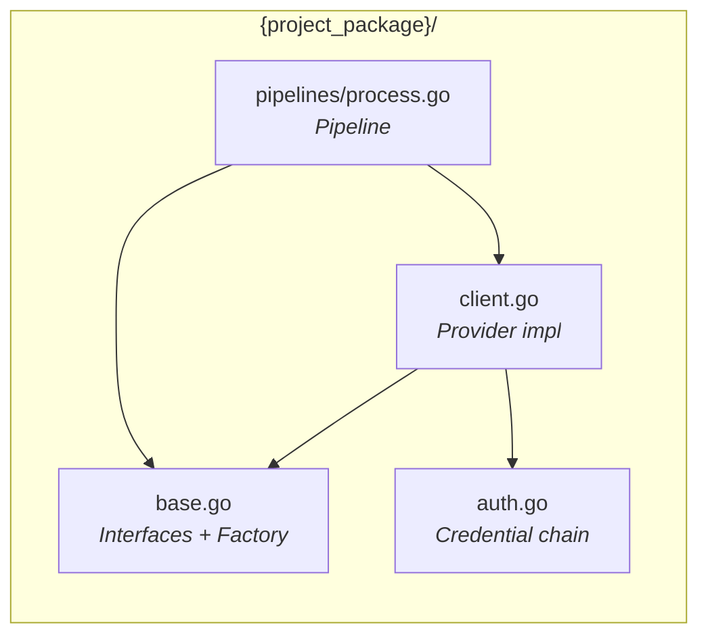
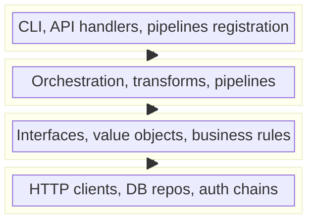
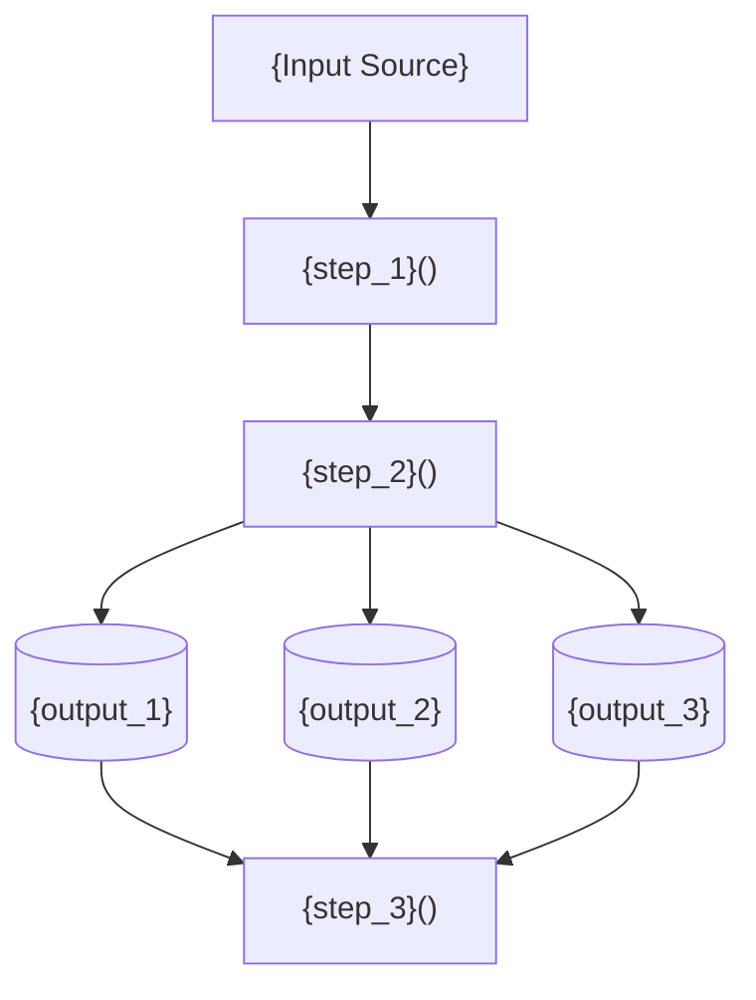
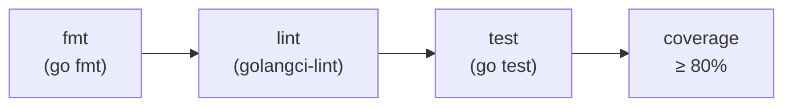

# {Project Name} — Specifications

> [!NOTE]
> **Spec-Driven Development (SDD) Template — v1.0.0**
>
> **How to use this template**
> 1. Copy this file to your project root as `SPECIFICATIONS.md`.
> 2. Replace every `{PLACEHOLDER}` with your project-specific values.
> 3. Fill every `<!-- FILL: ... -->` section. Delete the comment when done.
> 4. Sections marked ★ PRE-FILLED are ready to use — edit only if your tooling differs.
> 5. Feed the completed spec to Claude Opus 4.6 as the primary context for every implementation prompt.

> [!IMPORTANT]
> **The Contract** — This spec IS the source of truth. Code that contradicts the spec is a bug. A spec that contradicts reality must be updated first, then the code changed to match.

> [!TIP]
> **RFC-2119 Language**
> - **"shall" / "must"** = mandatory requirement (test must verify it)
> - **"should"** = strong recommendation (deviation needs justification)
> - **"may"** = optional (nice to have)

> **Version:** {0.1.0}  
> **Status:** Draft | In Review | Final  
> **Authors:** {Author 1}, {Author 2}  
> **License:** {Proprietary — Your Organization | MIT | Apache-2.0}

---

## Table of Contents

0. [AI Steering Preamble](#0-ai-steering-preamble)
1. [Introduction](#1-introduction)
2. [Goals & Non-Goals](#2-goals--non-goals)
3. [System Context & Dependencies](#3-system-context--dependencies)
4. [Architecture Overview](#4-architecture-overview)
5. [Module Specifications](#5-module-specifications)
6. [Configuration Specification](#6-configuration-specification)
7. [Data Flow & Processing Specification](#7-data-flow--processing-specification)
8. [Output Specification](#8-output-specification)
9. [Error Handling Specification](#9-error-handling-specification)
10. [Observability Specification](#10-observability-specification)
11. [Memory & Performance Specification](#11-memory--performance-specification)
12. [Security Specification](#12-security-specification)
13. [Extensibility Specification](#13-extensibility-specification)
14. [Backward Compatibility Specification](#14-backward-compatibility-specification)
15. [Testing Specification](#15-testing-specification) ★ PRE-FILLED
16. [Build, Tooling & Quality Specification](#16-build-tooling--quality-specification) ★ PRE-FILLED
17. [Documentation Specification](#17-documentation-specification) ★ PRE-FILLED

---

## 0. AI Steering Preamble

<!--
This section is consumed by the AI agent (Claude Opus 4.6) before it writes
a single line of code. It establishes the persona, the quality bar, the style
rules, and the hard constraints. It acts as a persistent "system prompt" that
never drifts between conversations.

DO NOT DELETE THIS SECTION. Refine it to match your organization's standards.
-->

### 0.1 AI Persona & Quality Bar

You are a **Staff Software Engineer** implementing this specification. Your code shall:

- Be **production-grade** — no TODOs, no placeholder logic, no "exercise left to the reader".
- Read like a **well-edited technical book** — clear naming, single responsibility, minimal comments (the code *is* the comment).
- Demonstrate **mastery of Go idioms** (e.g., explicit error handling, interface satisfaction, concurrency primitives).
- Treat every public symbol as a **published API** — stable signatures, complete Go Doc comments, defensive input validation.
- Prefer **composition over embedding** unless the spec explicitly prescribes a specific hierarchy.

### 0.2 Language Conventions (RFC-2119)

Throughout this specification:

| Keyword | Meaning |
|---------|---------|
| **shall** / **must** | Absolute requirement. A test **must** verify compliance. |
| **shall not** / **must not** | Absolute prohibition. |
| **should** | Strong recommendation. Deviation requires written justification in a code comment. |
| **may** | Truly optional. |

### 0.3 Code Style Mandate

Every source file **shall** comply with:

| Rule | Requirement |
|------|-------------|
| **Package Declaration** | Every file must start with a valid `package` declaration. |
| **Strong Typing** | All function signatures, struct fields, and variable declarations must be explicitly typed. Use interfaces for abstraction. |
| **Go Doc** | Standard Go documentation comments on every exported package, struct, interface, and function. |
| **Exporting** | Export only what is necessary by using PascalCase for public names. Keep internal logic private (camelCase). |
| **Imports** | stdlib → external → internal, sorted and grouped. Enforced by `goimports`. |
| **Logging** | `log/slog` or a structured logging library. Never `fmt.Print*`. Never log secrets. |
| **Constants** | `PascalCase` for exported, `camelCase` for private. Never magic numbers/strings in function bodies. |
| **Copyright header** | Every `.go` file **shall** begin with the organization's copyright header. |

### 0.4 Forbidden Anti-Patterns

The AI **shall not** generate code that contains any of the following:

| Anti-Pattern | Why It's Forbidden |
|--------------|--------------------|
| `//nolint` without a specific linter name and comment | Suppresses real bugs. If needed: `//nolint:errcheck // justified why`. |
| Ignoring errors (`_ = ...`) or missing `if err != nil` | Hides bugs. Always handle, wrap, or log errors. |
| Dot imports (`import . "package"`) | Pollutes namespace, makes code harder to follow. |
| Global mutable state (package-level vars modified at runtime) | Unless it's a **registry pattern** explicitly required by the spec. |
| Hard-coded secrets, URLs, or file paths | Must come from config, environment, or secret stores. |
| `time.Sleep()` without Context or select | Hard to cancel. Use `context.Context` or `time.Timer` with `select`. |
| God packages/structs (> 500 lines or > 10 exported methods) | Split into smaller, focused packages or collaborators. |
| Nested functions deeper than 2 levels (closures) | Extract to named functions or methods. |
| Comments that repeat the code (`// increment x` above `x++`) | Comments explain *why*, code explains *what*. |
| Dead code left in "just in case" | Version control exists. Delete it. |

### 0.5 Design Pattern Selection Guide

When implementing a feature, select from this catalog. **Document which pattern you chose in the package documentation.**

| Pattern | When to Use | Go Idiom |
|---------|-------------|----------|
| **Strategy** | Multiple interchangeable algorithms behind a common interface | Interface + concrete implementations |
| **Factory + Registry** | Creating objects by key without hard-coding imports | `map[string]Constructor` + `Register()` func |
| **Template Method** | Fixed lifecycle with customizable steps | Interface + Composition/Embedding |
| **Chain of Responsibility** | Ordered fallback/pipeline processing | Slice of handlers or linked structs |
| **Repository** | Decoupling data access from business logic | Interface with `Get()` / `Save()` methods |
| **Adapter** | Wrapping a third-party SDK behind your own interface | Wrapper struct satisfying internal interface |
| **Observer / Event** | Decoupled notification of state changes | Channels or slice of listener funcs |
| **Builder** | Complex object construction with many optional params | Functional Options or Builder struct |
| **Decorator** | Adding behavior without modifying a class | Middleware (func wrapping) or Embedding |
| **Singleton** | Exactly one instance (e.g., connection pool) | `sync.Once` or package-level instance |

---

## 1. Introduction

<!--
FILL: One paragraph describing what this project does and its role in the
larger system. Use present tense. Be specific — "processes X for Y" not
"does stuff".
-->

**{Project Name}** is a Go package that {brief description of what the project does}. It **shall** operate as {standalone library / CLI tool / pipeline plugin / microservice}.

### 1.1 Scope

This document specifies the functional and non-functional requirements for:

<!-- FILL: Bulleted list of 3–6 top-level capabilities this spec covers. -->
- {Capability 1 — e.g., "A provider-agnostic abstraction layer for X"}
- {Capability 2 — e.g., "A concrete implementation for Provider Y"}
- {Capability 3 — e.g., "A retry-resilient client with credential resolution"}
- {Capability 4 — e.g., "A data pipeline that reads, transforms, and writes"}

### 1.2 Definitions

<!-- FILL: Add every domain-specific term a new team member would need. -->

| Term | Definition |
|------|-----------|
| **{Term 1}** | {Definition} |
| **{Term 2}** | {Definition} |
| **{Term 3}** | {Definition} |

---

## 2. Goals & Non-Goals

### 2.1 Goals

<!-- FILL: Each goal gets a stable ID (G-N). Be concrete and testable. -->

| ID | Goal |
|----|------|
| G-1 | {Provide a **provider-agnostic** interface for X so downstream code is decoupled from vendors} |
| G-2 | {Ship a **production-ready** integration with Provider Y} |
| G-3 | {Ensure **no sensitive data leakage** — secrets excluded from serialization and logs} |
| G-4 | {Be usable as both a **standalone library** and a **plugin** via FactoryZ} |

### 2.2 Non-Goals

<!-- FILL: Explicitly state what this project does NOT do. Prevents scope creep. -->

| ID | Non-Goal |
|----|----------|
| NG-1 | {This library shall **not** implement its own ML model — it delegates to external providers} |
| NG-2 | {Pipeline orchestration and scheduling are **not** in scope} |
| NG-3 | {Real-time / streaming processing is **not** in scope — batch mode only} |

---

## 3. System Context & Dependencies

### 3.1 Runtime Requirements

| Requirement | Specification |
|-------------|--------------|
| **Go** | ≥ 1.22 |
| **OS** | {Linux, macOS — specify if Windows is excluded} |

<!-- FILL: Add any other runtime requirements (e.g., Node.js, etc.) -->

### 3.2 Package Dependencies

<!--
FILL: Every direct dependency, its version constraint, and why it exists.
The AI uses this to generate correct import statements and go.mod.
-->

| Package | Version Constraint | Purpose |
|---------|-------------------|---------|
| `{package-1}` | `>={x.y.z}` | {Why this package is needed} |
| `{package-2}` | `>={x.y.z}, <{a.b.c}` | {Why} |
| `avast/retry-go` | `>=4.0.0` | Retry with exponential backoff |

### 3.3 Optional Dependencies

| Package | Purpose |
|---------|---------|
| `joho/godotenv` | `latest` | `.env` file loading (optional) |

### 3.4 External Systems & APIs

<!--
FILL: Every external system this code talks to. Include auth method.
Leave empty if the library is self-contained.
-->

| System | Protocol | Auth Method | Timeout |
|--------|----------|-------------|---------|
| {Private AI API} | HTTPS | Bearer token | 30s |

---

## 4. Architecture Overview

### 4.1 Design Patterns Applied

<!--
FILL: Map each pattern from Section 0.5 to the module that uses it.
This table is the architectural blueprint the AI follows.
-->

| **{Strategy}** | {`base.go` — each provider is a pluggable strategy behind the `Client` interface} |
| **{Factory + Registry}** | {`base.go` — `ClientFactory` registers and creates `Client/Config` pairs by key} |
| **{Chain of Responsibility}** | {`auth.go` — credential resolution through ordered fallback handlers} |
| **{Template Method}** | {`pipelines/process.go` — `Pipeline` extends lifecycle: read → transform → write} |

### 4.2 Module Dependency Graph

<!--
FILL: Mermaid diagram showing every module and the direction of imports.
The AI uses this to avoid circular dependencies.
-->



### 4.3 Dependency Flow Rules

The dependency flow **shall** be strictly:

<!-- FILL: Define the import DAG. No cycles allowed. -->

- `base.go` → **no** internal imports
- `auth.go` → `base.go`
- `client.go` → `base.go`, `auth.go`
- `pipelines/*.go` → `base.go`, `client.go` (side-effect import for registration if needed)

### 4.4 Layered Architecture

<!--
FILL: If your project has clear layers, define them here.
Delete this subsection if not applicable.
-->



---

## 5. Package Specifications

> [!IMPORTANT]
> **How to write package specs** — For EACH package, create a subsection (5.N) with:
> 1. `SPEC-{PKG}-NNN` numbered requirements (e.g., `SPEC-BASE-001`).
> 2. A **struct field table**: field | type | default | description.
> 3. An **interface/method table**: method | signature | description.
> 4. **Error behavior**: what errors are returned and when.
> 5. **Invariants**: what must always be true (e.g., "thread-safe").
>
> This is the section where you invest the most time. The AI produces code that is a 1:1 map of these tables.

### 5.1 `{package_name}` — {Human-Readable Description}

#### SPEC-{PKG}-001: `{StructName}` {struct | interface}

The system **shall** provide a `{StructName}` {struct | interface} with the following fields:

| Field | Type | Default | Description |
|-------|------|---------|-------------|
| `{Field1}` | `string` | *(required)* | {What this field represents} |
| `{Field2}` | `int` | `0` | {What this field represents} |
| `{Field3}` | `[]string` | `nil` | {What this field represents} |

<!-- Add as many SPEC-{PKG}-NNN blocks as needed per package. -->

#### SPEC-{PKG}-002: `{StructName}` methods

The system **shall** provide the following methods:

| Method | Signature | Description |
|--------|-----------|-------------|
| `{Method1}` | `(arg string) (Result, error)` | {What it does} |
| `{Method2}` | `(items []string) ([]Result, error)` | {What it does} |

Error behavior:
- `{Method1}` **shall** return `ErrInvalidInput` if {condition}.
- `{Method2}` **shall** return `ErrNotFound` if {condition}.

<!--
REPEAT subsection 5.N for every module in your project.
Copy the template block above.
-->

### 5.2 `{next_module}` — {Description}

<!-- FILL: Continue with SPEC-{MOD}-NNN blocks for each module. -->

---

## 6. Configuration Specification

### 6.1 Configuration Format

<!--
FILL: Define what your config looks like (YAML, TOML, env vars, dataclass).
Include an example.
-->

The system **shall** accept configuration via {YAML file | environment variables | `go.mod` | struct constructor}:

```yaml
# Example configuration structure
{config_key}:
  {field_1}: {value}           # Required. {Description}.
  {field_2}: [{value}, ...]    # Required. {Description}.
  {nested_section}:            # Required.
    provider: {string}         # Optional (defaults to "{default_provider}").
    url: {string}              # Required.
```

### 6.2 Validation Rules

<!-- FILL: Every validation that shall run before processing starts. -->

| Validation | Error | Message Pattern |
|------------|-------|-----------------|
| `{config_key}` section present | `ValueError` | `"missing required '{config_key}'"` |
| `{field_1}` present and non-empty | `ValueError` | `"missing '{field_1}'"` |

### 6.3 Legacy Configuration Support

<!--
FILL: If you need backward-compatible config key migration, define it here.
Delete this subsection if not applicable.
-->

| Scenario | Behavior |
|----------|----------|
| Legacy key `{old_key}` present, new key `{new_key}` absent | Promote `{old_key}` with `provider: "{default}"`. Emit `DeprecationWarning`. |
| Both present | `{new_key}` takes precedence. |

---

## 7. Data Flow & Processing Specification

### 7.1 End-to-End Flow

<!-- FILL: Mermaid diagram showing the complete data flow. -->



### 7.2 Data Schemas

<!-- FILL: Define the shape of data at each stage. -->

**Input schema:**

| Column / Field | Type | Description |
|---------------|------|-------------|
| `{field}` | `string` | {Description} |

**Output schema:**

| Column / Field | Type | Description |
|---------------|------|-------------|
| `{field}` | `string` | {Description} |

---

## 8. Output Specification

<!-- FILL: For each output artifact, specify columns, rows, and constraints. -->

### 8.1 {Output Name 1} (e.g., primary result)

| Content | Specification |
|---------|--------------|
| Columns | {List of columns} |
| Rows | {What rows are included/excluded} |
| Constraints | {e.g., "original PII column shall be dropped"} |

### 8.2 {Output Name 2} (e.g., metadata)

| Content | Specification |
|---------|--------------|
| Columns | {List of columns} |
| Rows | {What rows are included/excluded} |

### 8.3 {Output Name 3} (e.g., dead-letter queue)

| Content | Specification |
|---------|--------------|
| Columns | {List of columns, including error info} |
| Rows | {Only rows where processing failed} |
| Purpose | {Failed rows can be reprocessed after fixing the root cause} |

---

## 9. Error Handling Specification

### 9.1 Error Taxonomy

<!--
FILL: Enumerate every error category, how it's handled, and the retry policy.
The AI uses this to generate error checks and fallback logic.
-->

| Category | Behavior | Retry Policy |
|----------|----------|--------------|
| **Transient network failure** | Retry with exponential backoff | Up to `MaxRetries` times, backoff `min(base × 2^attempt, 30s)` |
| **Batch processing failure** | Fall back to row-by-row processing | Per-item errors isolated |
| **Configuration validation** | Return `ErrInvalidConfig` immediately | No retry |
| **Authentication failure** | Chain of handlers; return `nil` if all fail | Per-handler, no cross-handler retry |

### 9.2 Error Definitions

<!--
FILL: Define any custom errors your project needs.
-->

```go
var (
    // ErrBase is the base error for the project
    ErrBase = errors.New("{project} error")

    // ErrConfiguration is returned when validation fails
    ErrConfiguration = fmt.Errorf("%w: invalid configuration", ErrBase)

    // ErrProvider is returned when an external provider call fails
    ErrProvider = fmt.Errorf("%w: provider failure", ErrBase)
)
```

### 9.3 Retry Specification

<!-- FILL: Concrete retry behavior. The AI generates tenacity decorators from this. -->

- Transient failures **shall** be retried up to `max_retries` times.
- Setting `max_retries=0` **shall** disable retries (fire once).
- Backoff **shall** be exponential: `min(retry_backoff_base × 2^attempt, 30)` seconds.
- On final exhaustion, the last error **shall** be returned (loud fail).
- An `ERROR`-level log entry containing `"FATAL"` **shall** be emitted before returning.

### 9.4 Fallback Strategy

<!-- FILL: Define any fallback logic (e.g., batch → row-by-row). Delete if not applicable. -->

| Scenario | Behavior |
|----------|----------|
| Batch call succeeds | All results mapped to their respective rows |
| Batch call fails | Fall back to row-by-row calls to isolate individual errors |
| Individual call fails in fallback | Error string recorded; row routed to dead-letter queue |

---

## 10. Observability Specification

### 10.1 Logging Standards

| Requirement | Specification |
|-------------|--------------|
| **Logger usage** | Use `slog` or a package-level logger |
| **Structured context** | Use `slog` attributes or key-value pairs |
| **Secrets** | **Shall never** appear in log messages at any level |
| **Level usage** | `DEBUG` = internal tracing; `INFO` = key lifecycle events; `WARN` = recoverable issues; `ERROR` = failures requiring attention |

### 10.2 Metrics

<!-- FILL: Define any metrics to emit (counters, histograms, etc.). Delete if not applicable. -->

| Metric | Type | Description |
|--------|------|-------------|
| `{project}_items_processed_total` | Counter | Total items successfully processed |
| `{project}_errors_total` | Counter | Total processing errors |

### 10.3 Health Checks

<!-- FILL: Define any health/readiness checks. Delete if not applicable. -->

---

## 11. Memory & Performance Specification

<!-- FILL: Define memory and performance constraints. Delete items that don't apply. -->

| Requirement | Specification |
|-------------|--------------|
| **SPEC-MEM-001** | {Processing shall use bounded batches — no unbounded `.collect()` calls} |
| **SPEC-MEM-002** | {Intermediate results shall be spilled to disk, not held in heap} |
| **SPEC-MEM-003** | {Output splits shall use lazy evaluation — no eager materialization} |
| **SPEC-PERF-001** | {Single-item latency shall be < {N}ms at p99} |
| **SPEC-PERF-002** | {Batch throughput shall be > {N} items/second} |

---

## 12. Security Specification

<!--
FILL: Define security requirements. These generate concrete code constraints.

Use the checklist below to audit your project for security concerns.
For each item that applies, add a SPEC-SEC-NNN row to the table below.

  SECRET MANAGEMENT
  □ Identify all fields that hold API keys, tokens, or credentials.
  □ Add them to `_SECRETS` so they are excluded from serialization and repr.
  □ Verify credentials are resolved at runtime, never baked into config dicts.

  SOURCE CODE SCAN
  □ No hard-coded secrets, private keys, or certificates in source files.
  □ No hard-coded internal URLs or IP addresses.
  □ No database connection strings with embedded passwords.

  DATA PROTECTION
  □ Identify columns or fields that contain PII or sensitive data.
  □ Specify which sensitive columns shall be dropped from outputs.
  □ Define data classification levels if applicable (public / internal / confidential).

  NETWORK & AUTH
  □ All external endpoints shall use HTTPS — no plain HTTP.
  □ OAuth2 / token endpoints shall enforce a timeout (e.g., 10 seconds).
  □ Bearer tokens shall not be logged at any level.
  □ Authentication tokens shall have bounded lifetimes / be refreshable.

  LOGGING & OBSERVABILITY
  □ Secrets shall never appear in log messages at any level.
  □ `String()` or `LogValue()` shall mask secret fields with "****".
  □ Error messages shall not leak stack traces containing secrets.

  DEPENDENCY SECURITY
  □ Dependencies shall be pinned and audited for known CVEs.
  □ Optional dependencies shall fail gracefully, not expose attack surface.

  SERIALIZATION BOUNDARIES
  □ Config objects crossing process boundaries (HTTP, queues)
    shall strip secrets before serialization.
  □ JSON serialization shall never include credential fields.
-->

| Requirement | Specification |
|-------------|--------------|
| **SPEC-SEC-001** | Fields tagged with `json:"-"` or sensitive tags **shall** be excluded from serialization so secrets are never shipped across process boundaries |
| **SPEC-SEC-002** | `String()` or `GoString()` methods **shall** mask secret fields with `"****"` (or show `<nil>` if unset) |
| **SPEC-SEC-003** | Credentials **shall** be resolved at runtime (not from serialized config) |
| **SPEC-SEC-004** | {Sensitive data columns shall be dropped from output} |
| **SPEC-SEC-005** | {OAuth2 endpoints shall use HTTPS and have a 10-second timeout} |

---

## 13. Extensibility Specification

### 13.1 Adding a New {Provider / Plugin / Strategy}

<!--
FILL: Step-by-step guide for extending the system. The AI uses this to
verify its Factory/Registry patterns are correct.
-->

To add a new {provider}, implementors **shall**:

1. Create a `{Config}` struct and register it via a `RegisterConfig("{key}", constructor)` function:
    - Set a field or tag for `provider: "{key}"`.
    - Tag sensitive fields to exclude them from logs/serialization.
2. Create a `{Client}` implementation that satisfies the required interface:
    - Implement `{Method1}(ctx, text) (Result, error)`.
    - Implement `{Method2}(ctx, texts) ([]Result, error)`.
3. Ensure the implementation is registered (usually via `init()` in the provider's package).

**No changes to existing code shall be required** (Open-Closed Principle).

### 13.2 Lifecycle Hook Points

<!-- FILL: List any points where subclasses can inject behavior. -->

| Hook | When Called | Override For |
|------|-----------|--------------|
| `before_read()` | Before data ingestion | Validation, setup |
| `after_write()` | After all outputs written | Cleanup, table optimization |

---

## 14. Backward Compatibility Specification

<!-- FILL: Define the public API contract and deprecation strategy. -->

| Requirement | Specification |
|-------------|--------------|
| **SPEC-COMPAT-001** | {Legacy config key `{old}` shall be accepted and auto-promoted} |
| **SPEC-COMPAT-002** | {A `DeprecationWarning` shall be emitted when the legacy key is used} |
| **SPEC-COMPAT-003** | {`Result` shall be re-exported from `{package}.client` for backward-compatible imports} |

---

## 15. Testing Specification

<!--
★ PRE-FILLED — This section is ready to use. Adjust thresholds and add
your project-specific test requirements to the table in 15.3.
-->

### 15.1 Test Philosophy

> **If it's in the spec, it has a test. If it doesn't have a test, it doesn't exist.**

- Every `SPEC-*` requirement in this document **shall** have at least one corresponding test.
- Tests **shall** be the executable proof that the specification is satisfied.
- Test names **shall** follow the pattern: `Test{Feature}_{Condition}_{Expected}`.

### 15.2 Test Structure

```
.
├── cmd/                           # Main applications
├── internal/                      # Private code
│   └── {package}/
│       ├── {file}.go
│       └── {file}_test.go         # Unit tests in the same package
└── tests/                         # Integration and end-to-end tests
    └── integration_test.go
```

### 15.3 Test Requirements Table

<!--
FILL: This is the most important testing artifact. For each area of the codebase,
enumerate the SPECIFIC test scenarios required. The AI generates test functions
directly from this table.

Use this format:
| **{Area name}** | {scenario 1}; {scenario 2}; {scenario 3} |
-->

| Area | Required Tests |
|------|---------------|
| **{Result value object}** | Default construction with required fields only; full construction with all fields; field types are correct |
| **{Config Interface}** | Implementation satisfies interface; `MarshalJSON` includes `provider` key; `UnmarshalJSON` drops unknown fields; `String()` masks sensitive fields with `"****"`; immutable behavior where applicable |
| **{Client Interface}** | Concrete implementation works; `Deidentify()` delegates to batch if appropriate; handles `context.Context` cancellation |
| **{Factory / Registry}** | `New()` returns correct client; unknown provider returns error with available list; `NewFromConfig()` full roundtrip; missing `provider` key returns error; `Available()` returns sorted list; duplicate registration logs warning and overwrites |
| **{Auth handler 1}** | Skips when precondition not met; resolves value when available; passes to next handler on miss; graceful when optional dependency missing |
| **{Auth handler 2}** | Skips when precondition not met; resolves from source; handles source unavailability |
| **{Auth chain wiring}** | Chain has N handlers in correct order; returns `nil` when all fail; short-circuits at first success; falls through to last handler |
| **{Provider Config}** | All defaults correct; custom values override defaults; `String()` masks secrets; `MarshalJSON` excludes secrets |
| **{Provider Client}** | Successful single call; successful batch call; no-results case returns empty; error propagation after retry exhaustion; retry succeeds after transient failure; `MaxRetries=0` fires once; error log contains "FATAL" on exhaustion |
| **{Pipeline registration}** | Key in factory `Available()`; factory `New()` returns correct type |
| **{Pipeline validation}** | Missing required section returns error; missing required field returns error; valid config passes |
| **{Pipeline transform}** | No-op on empty data; happy path produces expected outputs |
| **{Pipeline read/write}** | Handles I/O errors; single output writes to all |
| **{Metadata builder}** | All expected columns present; deterministic IDs; NULL/Empty input handling |
| **{Backward compat}** | New key preferred over legacy; legacy auto-promoted with warning |

### 15.4 Helper Standards

| Scope | Use Case | Example |
|-------|----------|---------|
| `TestMain` | Expensive shared resources (DB connection, global setup) | `func TestMain(m *testing.M)` |
| Package-level | Per-package setup | `setup()` function |
| Function | Per-test isolation | `t.Cleanup()` for cleanup |

**Factory functions** — When tests need objects with varying attributes, use a helper function:

```go
func newTestConfig(t *testing.T, overrides map[string]any) *MyConfig {
    t.Helper()
    cfg := &MyConfig{URL: "https://test.example.com", APIKey: "test-key"}
    // Apply overrides...
    return cfg
}
```

### 15.5 Mocking Policy

| Mock | Don't Mock |
|------|------------|
| External HTTP calls (APIs, SDKs) | Your own structs under test |
| File system I/O in unit tests | Pure business logic |
| Environment variables | Struct construction |
| Time-dependent operations | Collection operations |
| Third-party SDK constructors | Factory / registry internals |

**Rule:** If you find yourself mocking more than 3 things in a single test, the code under test has too many dependencies. Refactor first.

### 15.6 Coverage Thresholds


| Metric | Minimum | Enforced By |
|--------|---------|-------------|
| **Unit test line coverage** | **80%** | `go test -cover` |
| **New code coverage** | **90%** | PR review (manual) |

### 15.7 Test Naming Convention

```
Test{What}_{Condition}_{ExpectedOutcome}
```

Examples:
- `TestCreate_UnknownProvider_ReturnsError`
- `TestDeidentifyBatch_TransientFailure_RetriesAndSucceeds`
- `TestString_SecretIsSet_ShowsMaskedValue`

### 15.8 Boundary & Property-Based Testing Guidance

For core value objects and serialization, consider using fuzzing:

```go
func FuzzDeidentifyResultRoundtrip(f *testing.F) {
    f.Add("some text")
    f.Fuzz(func(t *testing.T, text string) {
        result := DeidentifyResult{ProcessedText: text}
        if result.ProcessedText != text {
            t.Errorf("roundtrip failed: got %q, want %q", result.ProcessedText, text)
        }
    })
}
```

Use for: serialization roundtrips, symmetry, boundary conditions.

---

## 16. Build, Tooling & Quality Specification

<!--
★ PRE-FILLED — These sections define the exact toolchain. Edit only the
placeholders marked with {}.
-->

### 16.1 Toolchain: `go`

| Setting | Value |
|---------|-------|
| **Tool** | [`go`](https://go.dev/) |
| **Dependency Manager** | `go mod` |
| **Linter** | `golangci-lint` |
| **Lock file** | `go.sum` |
| **Sync command** | `go mod tidy` |

### 16.2 `go.mod` — Module Definition

The `go.mod` **shall** define the module path and Go version.

```go
module {module-path}

go 1.22

require (
    // production dependencies
)
```

### 16.3 Linting & Formatting: `golangci-lint`

| Setting | Value | Rationale |
|---------|-------|-----------|
| `linter` | `golangci-lint` | Industry standard aggregator |
| `config` | `.golangci.yml` | Centralized config |
| `presets` | `bugs, unused, complexity` | Catch common issues |

**Zero-tolerance policy:** CI **shall** fail if `golangci-lint` reports any violation. No `//nolint` without an inline justification comment.

### 16.4 Type Checking

Go is statically typed. The compiler **shall** be the primary type checker. `golangci-lint` with `staticcheck` and `unused` shall provide additional safety.

### 16.5 Versioning: `commitizen`

| Setting | Value |
|---------|-------|
| **Format** | [Conventional Commits](https://www.conventionalcommits.org/) — `<type>(<scope>): <description>` |
| **Types** | `feat`, `fix`, `refactor`, `docs`, `test`, `ci`, `chore`, `perf`, `build` |
| **Tag format** | `v$version` (e.g., `v1.2.3`) |
| **Changelog** | Auto-generated in `CHANGELOG.md` on release |
| **Breaking changes** | Indicated by `!` after type or `BREAKING CHANGE:` in footer |

**Commit message examples:**

```
feat(auth): add OAuth2 client-credentials handler
fix(client): normalize single-item API responses to lists
refactor(base): extract secrets masking into helper
test(factory): add missing KeyError assertion for unknown provider
docs: update architecture diagram in SPECIFICATIONS.md
```

### 16.6 Makefile Targets

```makefile
.ONESHELL:
SHELL=/bin/zsh
UNIT_TEST_COVERAGE_FAIL_UNDER = 80

.PHONY: install build fmt lint test clean quality

install:
	go mod download
	go install github.com/golangci/golangci-lint/cmd/golangci-lint@latest

build:
	go build ./...

fmt:
	go fmt ./...

lint:
	golangci-lint run ./...

test:
	go test -v -coverprofile=coverage.out ./...
	go tool cover -func=coverage.out

clean:
	go clean
	rm -f coverage.out

quality: fmt lint test
```

### 16.7 Pre-commit Hooks

The project **shall** use `pre-commit` with at least these hooks:

```yaml
# .pre-commit-config.yaml
repos:
  - repo: https://github.com/golangci/golangci-lint
    rev: v1.64.5
    hooks:
      - id: golangci-lint
  - repo: https://github.com/pre-commit/mirrors-prettier
    rev: v4.0.0-alpha.4
    hooks:
      - id: prettier
```

### 16.8 CI/CD Quality Gates

The CI pipeline **shall** enforce this sequence. **Any failure blocks merge.**



| Gate | Tool | Failure Behavior |
|------|------|-----------------|
| **Format** | `go fmt` | Block merge if files would change |
| **Lint** | `golangci-lint` | Block merge on any violation |
| **Test** | `go test` | Block merge on test failure |
| **Coverage** | `go tool cover` | Block merge below threshold |

---

## 17. Documentation Specification

<!--
★ PRE-FILLED — This section defines documentation standards and the
generation process. Every module, class, and public function shall be
documented. AI agents shall follow this process when creating or modifying
source files.
-->

### 17.1 Documentation Philosophy

> **Code without documentation is a liability. Documentation without code is fiction.**

- Documentation **shall** live as close to the code as possible — docstrings over wikis.
- Every public symbol **shall** be self-documenting through its name, type hints, and docstring.
- README and API docs **shall** stay in sync with the source — stale docs are worse than no docs.

### 17.2 Docstring Standard

All documentation **shall** follow standard Go Doc conventions:

```go
// DeidentifyBatch de-identifies a batch of texts in a single HTTP call.
//
// It retries transient HTTP failures up to config.MaxRetries times
// with exponential backoff. On exhaustion the last error is returned.
//
// Parameters:
//   - ctx: Context for cancellation and timeouts.
//   - texts: List of raw text strings that may contain PII.
//
// Returns:
//   - A slice of DeidentifyResult, one per input text, in the same order.
//   - An error if all retries are exhausted or input is invalid.
func (c *Client) DeidentifyBatch(ctx context.Context, texts []string) ([]DeidentifyResult, error) {
```

| Element | Requirement |
|---------|-------------|
| **Package doc** | Every package **shall** have a `doc.go` or a package-level comment. |
| **Exported symbols** | Every exported struct, interface, and function **shall** have a comment. |
| **Signature** | Comments **shall** start with the name of the symbol. |
| **Examples** | Use `_test.go` files with `ExampleSymbolName` functions for runnable examples. |
| **Internal logic** | Use internal comments for complex logic; keep them concise. |

### 17.3 Documentation Generation Process

When creating or modifying a source file, the AI **shall** follow this process:

#### Step 1: Extract Signatures

- Identify all exported types, interfaces, and functions.
- Verify each has explicit types and uses `context.Context` for I/O bound operations.

#### Step 2: Write or Update Comments

- Write Go-style comments for every exported symbol.
- Ensure they start with the name of the symbol and follow a clear, descriptive style.

#### Step 3: Add Usage Examples

- Create `Example` functions in `_test.go` files for core functionality.
- Ensure examples are valid, runnable Go.

```go
/*
Package base provides provider-agnostic abstractions for de-identification.

Usage:
    factory := base.NewFactory()
    client, _ := factory.NewFromConfig(cfg)
    result, _ := client.Process(ctx, "My name is John Doe")
*/
package base
```

#### Step 4: Update Exports

- After adding or removing exported symbols, ensure they are correctly named (PascalCase).
- Verify the public API surface remains consistent.

#### Step 5: Update README and API Surface Docs

- When a new exported symbol is added:
    - Add it to the `README.md` usage section if it is part of the primary API.
- When an exported symbol is removed or renamed:
    - Update all references in `README.md`.
    - Provide a migration path if necessary.

#### Step 6: Validate Documentation Consistency

- Verify comments accurately describe parameters and return values.
- Verify examples are syntactically valid Go and pass `go test`.

### 17.4 Package Docstring Template

Every package **shall** have a `doc.go` or a package-level comment following this structure:

```go
// Package {package} provides {one-line summary}.
//
// Extended description explaining the package's role in the architecture,
// which design pattern it implements, and how it fits into the dependency
// graph.
//
// Pattern: {Strategy | Factory + Registry | Chain of Responsibility | ...}
//
// Usage:
//    import "{module-path}/{package}"
//
//    client := {package}.New(config)
//    result, err := client.{Method}(ctx, input)
package {package}
```

### 17.5 README Maintenance Rules

| Trigger | Action |
|---------|--------|
| New public class or function added | Add to README "API" or "Usage" section with a minimal example |
| Public symbol renamed or removed | Update all README references; note in CHANGELOG |
| New dependency added | Add to README "Requirements" section |
| New `Makefile` target added | Add to README "Development" section |
| Configuration schema changed | Update README configuration example |

### 17.6 Documentation Quality Checklist

Before merging code, verify:

- [ ] Every public struct has a docstring with a responsibility statement.
- [ ] Every public method has comments describing parameters and returns if non-obvious.
- [ ] Every public struct or non-trivial function has an `Example` function in tests.
- [ ] Package docstring states the design pattern used.
- [ ] README reflects any new or changed public API.
- [ ] No orphaned references to renamed or deleted symbols.

---

## Appendix A: Specification Checklist

<!--
Use this checklist before declaring the spec "Final".
Every box must be checked before the AI starts implementation.
-->

- [ ] **Section 0** — AI Preamble reviewed; forbidden anti-patterns list complete.
- [ ] **Section 1** — Introduction written; glossary covers all domain terms.
- [ ] **Section 2** — Every goal is testable; non-goals prevent scope creep.
- [ ] **Section 3** — Every dependency listed with version constraint and purpose.
- [ ] **Section 4** — Design patterns mapped to packages; dependency graph has no cycles.
- [ ] **Section 5** — Every package has SPEC-IDs; every exported symbol has field + method tables.
- [ ] **Section 6** — Config schema complete; validation rules cover all required fields.
- [ ] **Section 7** — Data flow diagram shows every stage; schemas defined for input/output.
- [ ] **Section 8** — Every output artifact specified (columns, rows, constraints).
- [ ] **Section 9** — Error taxonomy covers all failure modes; retry policy specified.
- [ ] **Section 10** — Logging levels defined; secrets exclusion rule documented.
- [ ] **Section 11** — Memory bounds specified; no unbounded collections.
- [ ] **Section 12** — Secret masking rules defined; PII handling documented.
- [ ] **Section 13** — Extension guide is step-by-step; Open-Closed Principle verified.
- [ ] **Section 14** — Public API surface defined; deprecation warnings specified.
- [ ] **Section 15** — Test requirements table has entry for every SPEC-ID.
- [ ] **Section 16** — All tool configs verified; `make quality` passes locally.
- [ ] **Section 17** — Go Doc standard followed; README maintenance rules documented.

---

## Appendix B: Implementation Task Decomposition

<!--
OPTIONAL — Break the spec into ordered, AI-executable tasks. Each task
references the SPEC-IDs it implements. Feed tasks to the AI one at a time
for incremental, reviewable implementation.

This follows the Requirements → Design → Tasks pattern.
-->

| Task | SPEC-IDs | Description | Dependencies |
|------|----------|-------------|--------------|
| T-1 | — | Scaffold project: `go.mod`, `Makefile`, directory structure | None |
| T-2 | SPEC-{PKG}-001, 002 | Implement `base.go`: value objects, interfaces, Factory | T-1 |
| T-3 | SPEC-{PKG}-001..005 | Implement `auth.go`: handler chain | T-2 |
| T-4 | SPEC-{PKG}-001..006 | Implement `client.go`: provider integration | T-2, T-3 |
| T-5 | SPEC-{PKG}-001..010 | Implement `pipelines/process.go`: pipeline | T-2, T-4 |
| T-6 | Section 15 | Write all unit tests | T-2..T-5 |
| T-7 | Section 16 | Verify `make quality` passes; fix all lint errors | T-6 |

---

## Appendix C: Companion Steering File

<!--
Create a separate STEERING.md in your project root containing the rules
below. This file acts as a persistent AI instruction set across ALL
conversations — not just spec implementation.
-->

The following rules **shall** be placed in a `STEERING.md` (or equivalent AI rules file) at the project root:

```markdown
# Project Steering Rules

## Always

- Use explicit error handling (`if err != nil`).
- Use Go Doc comments on every exported symbol.
- Use PascalCase for exported names and camelCase for private names.
- Use `context.Context` for all I/O and long-running operations.
- Use `slog` for structured logging.
- Use interfaces to decouple packages and facilitate testing.
- Write test names as: `Test{What}_{Condition}_{ExpectedOutcome}`.

## Never

- Never ignore errors (`_ = ...`) without a documented reason.
- Never use dot imports (`import . "package"`).
- Never use global mutable state (package-level variables).
- Never hard-code secrets, URLs, or file paths.
- Never use `time.Sleep()` without a way to cancel it (use `Context` or `select`).
- Never use `//nolint` without a specific linter and justification.
- Never leave dead code — delete it.
- Never use `fmt.Print*` for logging — use `slog`.
- Never commit `.env` files or secrets to version control.

## Architecture

- Dependency flow is strictly one-directional. No circular imports.
- Use internal packages for private implementation details.
- Every interface lives where it is used (consumer-defined interfaces) or in a base package if shared.
- Registrations happen via `Register` functions, typically in `init()`.
- Config objects are structs. Runtime state goes in service/client instances.
```

---

*End of Specification Template — v1.0.0*
