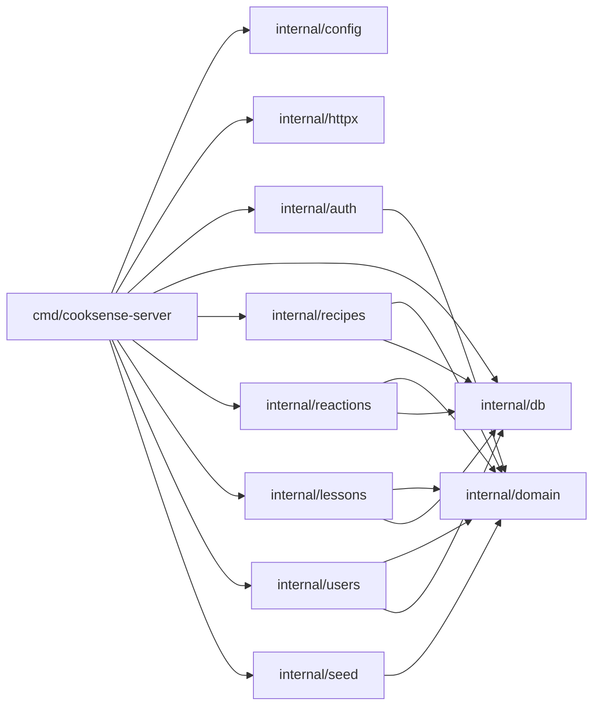

# CookSense Backend — Bootstrap Project Structure Specification

> **Spec-Driven Development (SDD) — Story 01**
>
> **Story:** 01 — Bootstrap project structure  
> **Status:** Final  
> **Version:** 1.0.0  
> **Authors:** CookSense Engineering  
> **License:** Proprietary — CookSense

> [!IMPORTANT]
> **The Contract** — This spec IS the source of truth. Code that contradicts
> the spec is a bug. A spec that contradicts reality must be updated first,
> then the code changed to match.

> [!TIP]
> **RFC-2119 Language**
> - **"shall" / "must"** = mandatory requirement (test must verify it)
> - **"should"** = strong recommendation (deviation needs justification)
> - **"may"** = optional

---

## Table of Contents

0. [AI Steering Preamble](#0-ai-steering-preamble)
1. [Introduction](#1-introduction)
2. [Goals & Non-Goals](#2-goals--non-goals)
3. [System Context & Dependencies](#3-system-context--dependencies)
4. [Architecture Overview](#4-architecture-overview)
5. [Package Specifications](#5-package-specifications)
6. [Configuration Specification](#6-configuration-specification)
7. [Build, Tooling & Quality Specification](#7-build-tooling--quality-specification)
8. [Testing Specification](#8-testing-specification)
9. [Documentation Specification](#9-documentation-specification)
10. [Appendix A — Specification Checklist](#appendix-a--specification-checklist)
11. [Appendix B — Implementation Task Decomposition](#appendix-b--implementation-task-decomposition)

---

## 0. AI Steering Preamble

### 0.1 AI Persona & Quality Bar

You are a **Staff Software Engineer** implementing this specification. Your code shall:

- Be **production-grade** — no TODOs, no placeholder logic, no "exercise left to the reader".
- Read like a **well-edited technical book** — clear naming, single responsibility, minimal comments (the code *is* the comment).
- Demonstrate **mastery of Go idioms** (explicit error handling, interface satisfaction).
- Treat every public symbol as a **published API** — stable signatures, complete Go Doc comments.

### 0.2 Language Conventions (RFC-2119)

| Keyword | Meaning |
|---------|---------|
| **shall** / **must** | Absolute requirement. A test **must** verify compliance. |
| **shall not** / **must not** | Absolute prohibition. |
| **should** | Strong recommendation. Deviation requires written justification. |
| **may** | Truly optional. |

### 0.3 Code Style Mandate

Every source file **shall** comply with:

| Rule | Requirement |
|------|-------------|
| **Package Declaration** | Every file must start with a valid `package` declaration. |
| **Go Doc** | Standard Go documentation comments on every exported package, struct, interface, and function. |
| **Imports** | stdlib → external → internal, sorted and grouped. Enforced by `goimports`. |
| **Logging** | `log/slog`. Never `fmt.Print*`. Never log secrets. |
| **Constants** | `PascalCase` for exported, `camelCase` for private. Never magic strings in function bodies. |

### 0.4 Forbidden Anti-Patterns

The AI **shall not** generate code that contains any of the following:

| Anti-Pattern | Why It's Forbidden |
|--------------|--------------------|
| `//nolint` without a specific linter name and comment | Suppresses real bugs. |
| Ignoring errors (`_ = ...`) | Hides bugs. |
| Dot imports (`import . "package"`) | Pollutes namespace. |
| Global mutable state | No package-level vars modified at runtime. |
| Hard-coded secrets, URLs, or file paths | Must come from config or environment. |
| Dead code left "just in case" | Version control exists. Delete it. |
| Comments that repeat the code | Comments explain *why*, code explains *what*. |

---

## 1. Introduction

**cooksense-backend** is the Go-based HTTP API server for the CookSense recipe application. It **shall** operate as a standalone HTTP microservice that provides recipe discovery, ingredient-based search, user reactions, and cooking lessons to a Firebase-authenticated mobile/web frontend.

This specification covers Story 01: **the foundational project skeleton** that every subsequent story builds upon. It defines the package layout, `doc.go` convention, placeholder entry point, migration directory structure, `.gitignore` rules, and `go.mod` version declaration.

### 1.1 Scope

This document specifies:

- The canonical `internal/` package tree and the `doc.go` placeholder contract for each package.
- The placeholder `cmd/cooksense-server/main.go` behaviour (compile + print + exit 0).
- The `migrations/`, `seed/recipes/`, and `seed/lessons/` directory structure.
- The `.gitignore` rules protecting secrets, build artefacts, and local overrides.
- The `go.mod` module path and Go version constraint.

### 1.2 Definitions

| Term | Definition |
|------|-----------|
| **doc.go** | A Go source file whose sole purpose is to carry the package-level documentation comment. Contains only the `package` declaration (and the comment above it). |
| **placeholder** | A file that satisfies the compiler and the package contract but contains no production logic. It will be replaced by a fully-featured implementation in a later story. |
| **SPEC-BOOT-NNN** | Requirement identifier for the Bootstrap story. NNN is a zero-padded three-digit number. |
| **internal package** | A Go package under `internal/` that cannot be imported by code outside this module. |

---

## 2. Goals & Non-Goals

### 2.1 Goals

| ID | Goal |
|----|------|
| G-1 | Provide a **complete, compilable project skeleton** so that any contributor can clone and run `go build ./...` on a clean machine without errors. |
| G-2 | Enforce the **Clean Architecture layer contract** through the package tree before any business logic is written. |
| G-3 | Protect secrets and build artefacts from accidental commits via a **complete `.gitignore`**. |
| G-4 | Anchor the **Go version** at `1.26.2` so all contributors and CI use identical language semantics. |
| G-5 | Provide a **navigable package tree** where any contributor can locate the right package by feature name, not by hunting. |

### 2.2 Non-Goals

| ID | Non-Goal |
|----|----------|
| NG-1 | This story **does not** implement any real wiring (config loading, database pool, HTTP server, Firebase auth). That is covered by stories 03, 04, 07. |
| NG-2 | This story **does not** add the `Makefile`. That is covered by story 02. |
| NG-3 | This story **does not** add third-party dependencies (`pgx`, `firebase-admin`, `golang-migrate`, `yaml.v3`). |
| NG-4 | This story **does not** write integration tests or seed data. |

---

## 3. System Context & Dependencies

### 3.1 Runtime Requirements

| Requirement | Specification |
|-------------|--------------|
| **Go** | `1.26.2` (exact, matching `go.mod` declaration) |
| **OS** | Linux, macOS |

### 3.2 Package Dependencies

No new third-party dependencies are introduced in Story 01.

The `go.mod` **shall** declare the module path `github.com/cooksense/cooksense-backend` (or the existing module path already in `go.mod` — do not change it) and the Go version `1.26.2`. No `require` block additions are needed.

### 3.3 External Systems & APIs

None. Story 01 is purely structural — no network calls, no I/O beyond stdout.

---

## 4. Architecture Overview

### 4.1 Design Patterns Applied

| Pattern | Usage in this story |
|---------|---------------------|
| **Package-per-feature** | Each `internal/` subdirectory corresponds to one bounded domain context (recipes, reactions, auth, …). |
| **Dependency Inversion (future)** | `internal/domain` will hold interfaces; all other packages depend on it, never the reverse. Enforced *structurally* from story 01 onward. |

### 4.2 Module Dependency Graph

Story 01 establishes the directory structure. No inter-package imports exist yet. The intended final flow (enforced from story 01 onward by the no-cross-import rule in `internal/domain`) is:



### 4.3 Dependency Flow Rules

The dependency flow **shall** be strictly:

- `internal/domain` → **no** internal imports (pure business types and interfaces, zero external deps).
- `internal/config` → stdlib only.
- `internal/db`, `internal/httpx`, `internal/auth` → `internal/domain` only (plus stdlib; third-party adapters arrive in later stories).
- `internal/recipes`, `internal/reactions`, `internal/lessons`, `internal/users`, `internal/seed` → `internal/domain`, `internal/db` (domain interfaces only; no cross-feature imports).
- `cmd/cooksense-server` → all `internal/` packages (wiring point only).

**Circular imports are strictly forbidden.** The Go compiler enforces this at build time.

### 4.4 Layered Architecture

```
┌──────────────────────────────────────────────┐
│  Presentation / Entry Points                 │
│  cmd/cooksense-server, internal/httpx        │
├──────────────────────────────────────────────┤
│  Service / Use Cases                         │
│  internal/recipes, /reactions, /lessons,     │
│  /users, /seed                               │
├──────────────────────────────────────────────┤
│  Domain / Core                               │
│  internal/domain  ← zero imports             │
├──────────────────────────────────────────────┤
│  Infrastructure / Adapters                   │
│  internal/db, internal/auth, internal/config │
└──────────────────────────────────────────────┘
```

---

## 5. Package Specifications

> For Story 01 each package spec covers only the `doc.go` placeholder. Method and struct tables will be populated in the stories that implement each package's real functionality.

### 5.1 `internal/config` — Runtime configuration loading

#### SPEC-BOOT-001: `internal/config` package declaration

The system **shall** provide a file `internal/config/doc.go` with:

- A package-level comment: `// Package config provides runtime configuration loading and validation for cooksense-server.`
- Only the `package config` declaration below the comment.
- No imports.
- No exported symbols.

#### SPEC-BOOT-002: `internal/config` isolation

`internal/config` **shall not** import any other `internal/` package in Story 01.

---

### 5.2 `internal/httpx` — HTTP server primitives

#### SPEC-BOOT-003: `internal/httpx` package declaration

The system **shall** provide a file `internal/httpx/doc.go` with:

- A package-level comment: `// Package httpx provides HTTP server construction, middleware, and error-response helpers for cooksense-server.`
- Only the `package httpx` declaration.
- No imports. No exported symbols.

---

### 5.3 `internal/auth` — Firebase authentication

#### SPEC-BOOT-004: `internal/auth` package declaration

The system **shall** provide a file `internal/auth/doc.go` with:

- A package-level comment: `// Package auth provides Firebase ID-token verification and authenticated-user context helpers.`
- Only the `package auth` declaration.
- No imports. No exported symbols.

---

### 5.4 `internal/db` — Database connection pool

#### SPEC-BOOT-005: `internal/db` package declaration

The system **shall** provide a file `internal/db/doc.go` with:

- A package-level comment: `// Package db provides the PostgreSQL connection pool and migration runner for cooksense-server.`
- Only the `package db` declaration.
- No imports. No exported symbols.

---

### 5.5 `internal/domain` — Business types and interfaces

#### SPEC-BOOT-006: `internal/domain` package declaration

The system **shall** provide a file `internal/domain/doc.go` with:

- A package-level comment: `// Package domain defines the core business entities, value objects, and repository interfaces for CookSense.`
- Only the `package domain` declaration.
- No imports. No exported symbols.

#### SPEC-BOOT-007: `internal/domain` zero-import rule

`internal/domain` **shall not** import any other `internal/` package — now or in future stories. Violations are rejected at code review.

---

### 5.6 `internal/recipes` — Recipe feature

#### SPEC-BOOT-008: `internal/recipes` package declaration

The system **shall** provide a file `internal/recipes/doc.go` with:

- A package-level comment: `// Package recipes implements the recipe discovery, detail, and ingredient-search feature of CookSense.`
- Only the `package recipes` declaration.
- No imports. No exported symbols.

---

### 5.7 `internal/reactions` — User reactions

#### SPEC-BOOT-009: `internal/reactions` package declaration

The system **shall** provide a file `internal/reactions/doc.go` with:

- A package-level comment: `// Package reactions implements the LIKE / DISLIKE / TRY_LATER reaction feature for CookSense recipes.`
- Only the `package reactions` declaration.
- No imports. No exported symbols.

---

### 5.8 `internal/lessons` — Cooking school

#### SPEC-BOOT-010: `internal/lessons` package declaration

The system **shall** provide a file `internal/lessons/doc.go` with:

- A package-level comment: `// Package lessons implements the Cooking School feature, serving curated culinary lesson articles.`
- Only the `package lessons` declaration.
- No imports. No exported symbols.

---

### 5.9 `internal/users` — User provisioning

#### SPEC-BOOT-011: `internal/users` package declaration

The system **shall** provide a file `internal/users/doc.go` with:

- A package-level comment: `// Package users provides lazy user provisioning and profile management backed by Firebase UID.`
- Only the `package users` declaration.
- No imports. No exported symbols.

---

### 5.10 `internal/seed` — Seed data loader

#### SPEC-BOOT-012: `internal/seed` package declaration

The system **shall** provide a file `internal/seed/doc.go` with:

- A package-level comment: `// Package seed loads curated recipe and lesson data from YAML files into the database at startup.`
- Only the `package seed` declaration.
- No imports. No exported symbols.

---

### 5.11 `cmd/cooksense-server/main.go` — Entry point

#### SPEC-BOOT-013: Placeholder `main` function

The file `cmd/cooksense-server/main.go` **shall** contain a `main` function that:

1. Prints the exact string `"cooksense-server starting"` to stdout using `fmt.Println`.
2. Exits with code `0` (normal return from `main`).

It **shall not** import any `internal/` package in Story 01 (real wiring arrives in stories 03/04/07).

#### SPEC-BOOT-014: `main.go` imports

`cmd/cooksense-server/main.go` **shall** import only `"fmt"` from the standard library.

---

### 5.12 `migrations/` — SQL migration files

#### SPEC-BOOT-015: `migrations/` directory

The directory `migrations/` **shall** exist at the project root. Because no SQL files are added in Story 01, the directory **shall** contain a single `.gitkeep` file to ensure it is tracked by Git.

---

### 5.13 `seed/recipes/` and `seed/lessons/` — Seed YAML directories

#### SPEC-BOOT-016: Seed sub-directories

The directories `seed/recipes/` and `seed/lessons/` **shall** exist at the project root. Because no YAML files are added in Story 01, each directory **shall** contain a single `.gitkeep` file.

---

### 5.14 `.gitignore`

#### SPEC-BOOT-017: `.gitignore` rules

The project-root `.gitignore` **shall** contain at minimum the following rules:

| Pattern | Rationale |
|---------|-----------|
| `bin/` | Compiled binaries produced by `go build`. |
| `secrets/` | Directory for local service-account JSON files (except `*.example`). |
| `secrets/*.json` | Firebase Admin SDK credentials and other JSON secrets. |
| `!secrets/*.example` | Explicitly un-ignores example/template credential files so they are committed. |
| `.env` | Local environment variable overrides. |
| `*.local.*` | Any file following the `name.local.ext` convention (e.g., `config.local.yaml`). |
| `coverage.out` | Go test coverage profiles. |
| `*.test` | Compiled test binaries. |

The `.gitignore` **should** also include standard Go and OS rules (e.g., `vendor/`, `.DS_Store`).

---

### 5.15 `go.mod` — Module declaration

#### SPEC-BOOT-018: Go version

The `go.mod` file **shall** declare `go 1.26.2`. Any lower version declaration is a violation of decision D-0001.

#### SPEC-BOOT-019: Module path

The `go.mod` **shall** preserve the existing module path. It **shall not** be changed in Story 01.

---

## 6. Configuration Specification

Story 01 introduces **no runtime configuration**. The `internal/config` package is scaffolded as a placeholder (SPEC-BOOT-001). The full configuration specification (env vars, `Config` struct, validation) is covered in Story 03.

---

## 7. Build, Tooling & Quality Specification

### 7.1 Build Verification

| Requirement | Command | Expected outcome |
|-------------|---------|-----------------|
| **SPEC-BOOT-020** | `go build ./...` | Exits `0`. No errors, no warnings. |
| **SPEC-BOOT-021** | `go vet ./...` | Exits `0`. Zero issues reported. |

### 7.2 Go Version

| Setting | Value |
|---------|-------|
| **Tool** | `go` |
| **Required version** | `1.26.2` |
| **Declared in** | `go.mod` (`go 1.26.2`) |

### 7.3 Linting

`golangci-lint run` **should** produce zero violations. Because Story 01 contains only `doc.go` placeholders and a trivial `main.go`, lint violations at this stage indicate a tooling misconfiguration that **shall** be fixed before marking the story done.

### 7.4 Formatting

All `.go` files **shall** be formatted by `go fmt ./...` with zero diffs. CI **shall** fail if any file would change.

---

## 8. Testing Specification

### 8.1 Test Philosophy

Story 01 is a purely structural story. There is no business logic, no I/O, and no state to unit-test. However, the following verifications **shall** be performed as part of the Definition of Done:

| Verification | How |
|-------------|-----|
| **SPEC-BOOT-022**: All packages compile | `go build ./...` exits `0` |
| **SPEC-BOOT-023**: `main` prints and exits | `go run ./cmd/cooksense-server` outputs `cooksense-server starting` and exits `0` |
| **SPEC-BOOT-024**: Vet passes | `go vet ./...` exits `0` |

No `_test.go` files are required in Story 01. Test infrastructure (httptest, testcontainers) is introduced in Story 11.

### 8.2 Test Naming Convention (for future stories)

```
Test{What}_{Condition}_{ExpectedOutcome}
```

### 8.3 Coverage Thresholds

Story 01 introduces no testable logic. The coverage floor of **80%** (new code **90%**) applies from Story 03 onward.

---

## 9. Documentation Specification

### 9.1 Package Docstring Standard

Every `doc.go` **shall** follow this template:

```go
// Package {name} {one-line description starting with a verb}.
package {name}
```

The description **shall** be a single sentence. It **shall** start with a verb in the present tense (e.g., "provides", "implements", "defines", "loads").

Examples of compliant comments:

```go
// Package config provides runtime configuration loading and validation for cooksense-server.
package config
```

```go
// Package domain defines the core business entities, value objects, and repository interfaces for CookSense.
package domain
```

### 9.2 `main.go` Documentation

`cmd/cooksense-server/main.go` **shall** carry a file-level comment stating the binary's purpose:

```go
// Command cooksense-server is the HTTP API server for the CookSense application.
package main
```

### 9.3 README Maintenance

Story 01 **shall not** modify `README.md` (that is deferred to Story 12). The PR description **shall** include the output of `tree -L 2 internal/` to prove the layout is correct.

---

## Appendix A — Specification Checklist

Use this checklist before starting implementation. Every box must be checked.

- [x] **Section 0** — AI Preamble reviewed; forbidden anti-patterns list complete.
- [x] **Section 1** — Introduction written; glossary covers all domain terms.
- [x] **Section 2** — Every goal is testable; non-goals prevent scope creep.
- [x] **Section 3** — Dependencies listed; no new third-party deps in Story 01.
- [x] **Section 4** — Design pattern (package-per-feature) mapped; dependency graph has no cycles; layered architecture defined.
- [x] **Section 5** — Every package has SPEC-BOOT-NNN IDs (001–019); every `doc.go` content is fully specified.
- [x] **Section 6** — Config deferred to Story 03; noted explicitly.
- [x] **Section 7** — Build commands and toolchain verified; `go.mod` version pinned.
- [x] **Section 8** — Test philosophy for structural story clarified; coverage deferred to Story 03+.
- [x] **Section 9** — Go Doc standard defined; `doc.go` template provided; README update deferred to Story 12.

---

## Appendix B — Implementation Task Decomposition

Ordered list of atomic tasks for Story 01. Each task **shall** be implemented, reviewed, and passing `go build ./...` + `go vet ./...` before the story is marked Done.

| Task | SPEC-IDs | Description | Dependencies |
|------|----------|-------------|--------------|
| T-01 | SPEC-BOOT-018, SPEC-BOOT-019 | Update `go.mod` to declare `go 1.26.2` | None |
| T-02 | SPEC-BOOT-017 | Create or update `.gitignore` with all required patterns | None |
| T-03 | SPEC-BOOT-001, SPEC-BOOT-002 | Create `internal/config/doc.go` | T-01 |
| T-04 | SPEC-BOOT-003 | Create `internal/httpx/doc.go` | T-01 |
| T-05 | SPEC-BOOT-004 | Create `internal/auth/doc.go` | T-01 |
| T-06 | SPEC-BOOT-005 | Create `internal/db/doc.go` | T-01 |
| T-07 | SPEC-BOOT-006, SPEC-BOOT-007 | Create `internal/domain/doc.go` | T-01 |
| T-08 | SPEC-BOOT-008 | Create `internal/recipes/doc.go` | T-01 |
| T-09 | SPEC-BOOT-009 | Create `internal/reactions/doc.go` | T-01 |
| T-10 | SPEC-BOOT-010 | Create `internal/lessons/doc.go` | T-01 |
| T-11 | SPEC-BOOT-011 | Create `internal/users/doc.go` | T-01 |
| T-12 | SPEC-BOOT-012 | Create `internal/seed/doc.go` | T-01 |
| T-13 | SPEC-BOOT-013, SPEC-BOOT-014 | Update `cmd/cooksense-server/main.go` with placeholder `main` | T-01 |
| T-14 | SPEC-BOOT-015 | Create `migrations/.gitkeep` | None |
| T-15 | SPEC-BOOT-016 | Create `seed/recipes/.gitkeep` and `seed/lessons/.gitkeep` | None |
| T-16 | SPEC-BOOT-020, SPEC-BOOT-021 | Verify `go build ./...` and `go vet ./...` pass | T-02..T-15 |
| T-17 | SPEC-BOOT-022, SPEC-BOOT-023, SPEC-BOOT-024 | Run smoke verification: `go run ./cmd/cooksense-server` outputs `cooksense-server starting` | T-16 |

---

*End of SPEC-BOOT — Story 01 Bootstrap Project Structure — v1.0.0*
