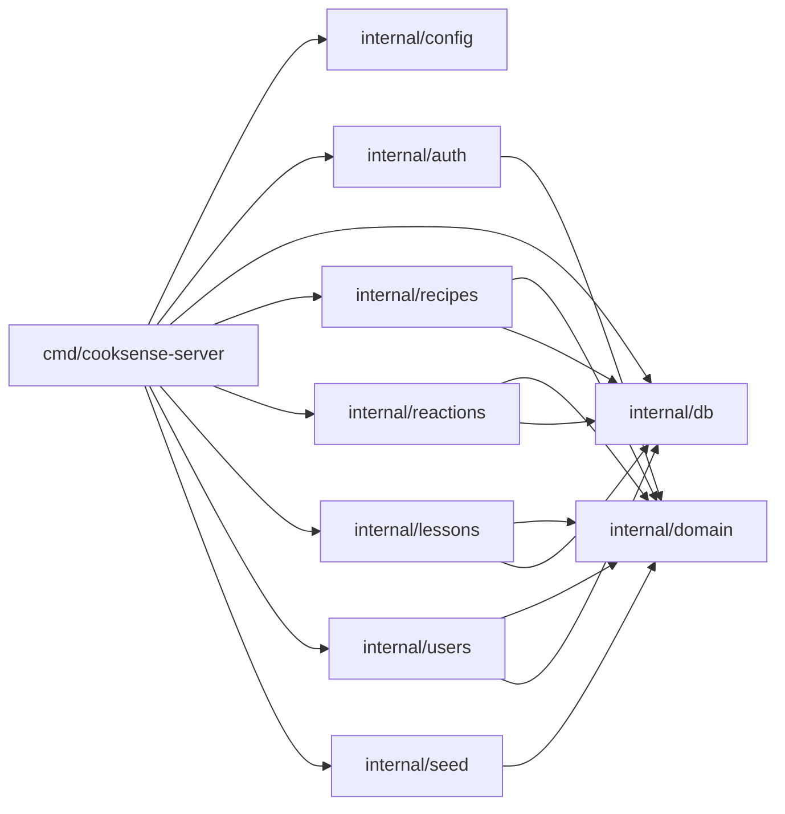

# SPEC-BOOT-05 — Architecture Overview

> Part of [SPEC-BOOT](SPEC-BOOT-00-index.md) — Story 01: Bootstrap Project Structure

---

## 4. Architecture Overview

### 4.1 Design Patterns Applied

| Pattern | Usage in this story |
|---------|---------------------|
| **Package-per-feature** | Each `internal/` subdirectory corresponds to one bounded domain context (recipes, reactions, auth, …). |
| **Dependency Inversion (future)** | `internal/domain` will hold interfaces; all other packages depend on it, never the reverse. Enforced *structurally* from story 01 onward. |

### 4.2 Module Dependency Graph

Story 01 establishes the directory structure. No inter-package imports exist yet. The intended final flow (enforced from story 01 onward by the no-cross-import rule in `internal/domain`) is:



### 4.3 Dependency Flow Rules

The dependency flow **shall** be strictly:

- `internal/domain` → **no** internal imports (pure business types and interfaces, zero external deps).
- `internal/config` → stdlib only.
- `internal/db`, `internal/auth` → `internal/domain` only (plus stdlib; third-party adapters arrive in later stories).
- `internal/recipes`, `internal/reactions`, `internal/lessons`, `internal/users`, `internal/seed` → `internal/domain`, `internal/db` (domain interfaces only; no cross-feature imports).
- `cmd/cooksense-server` → all `internal/` packages (wiring point only).

**Circular imports are strictly forbidden.** The Go compiler enforces this at build time.

### 4.4 Layered Architecture

```
┌──────────────────────────────────────────────┐
│  Presentation / Entry Points                 │
│  cmd/cooksense-server (uses net/http)        │
├──────────────────────────────────────────────┤
│  Service / Use Cases                         │
│  internal/recipes, /reactions, /lessons,     │
│  /users, /seed                               │
├──────────────────────────────────────────────┤
│  Domain / Core                               │
│  internal/domain  ← zero imports             │
├──────────────────────────────────────────────┤
│  Infrastructure / Adapters                   │
│  internal/db, internal/auth, internal/config │
└──────────────────────────────────────────────┘
```
