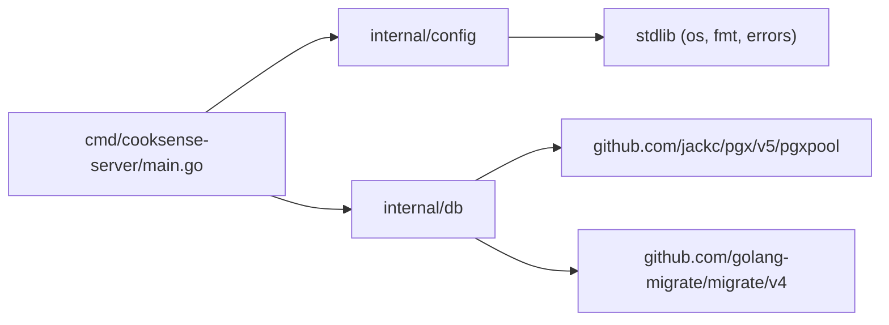
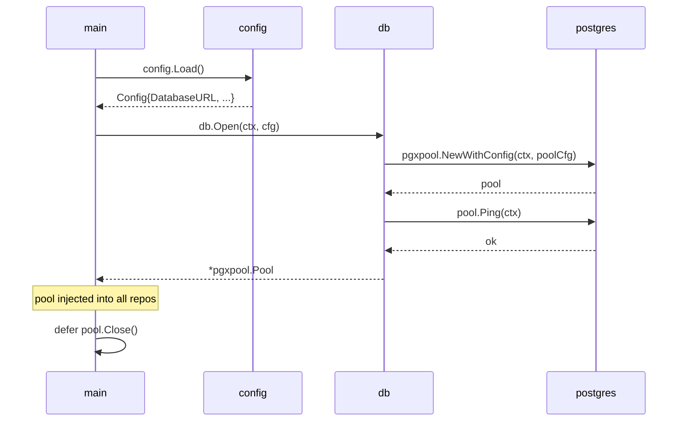

# SPEC-DB-05 — Architecture Overview

> Part of [SPEC-DB](SPEC-DB-00-index.md) — Story 03: Database pgx Pool, Migrations & Initial Schema

---

## 4. Architecture Overview

### 4.1 Design Patterns Applied

| Pattern | Usage in Story 03 |
|---------|-------------------|
| **Constructor Injection** | `db.Open` returns a `*pgxpool.Pool` that callers store and pass to repositories. No global pool. |
| **Fail-Fast Configuration** | `config.Load()` validates all required vars at startup; missing values → immediate `os.Exit(1)` (via log + return error to `main`). |
| **Command Pattern (CLI subcommand)** | `main.go` dispatches `os.Args[1]` to route `migrate up` / `migrate down N` to `db.Up` / `db.Down`. |

### 4.2 Dependency Graph



### 4.3 Pool Lifecycle



### 4.4 Subcommand Dispatch

```mermaid
flowchart TD
    A["os.Args"] --> B{args[1]}
    B -- "migrate" --> C{args[2]}
    C -- "up" --> D["db.Up(ctx, dsn, migrationsDir)"]
    C -- "down" --> E["db.Down(ctx, dsn, migrationsDir, N)"]
    B -- other --> F["start HTTP server (future stories)"]
    D --> G["exit 0 / 1"]
    E --> G
```

### 4.5 Idempotency Guarantee

`golang-migrate` tracks applied migrations in a `schema_migrations` table (created automatically). Running `db.Up` when all migrations are already applied returns `migrate.ErrNoChange`, which **shall** be treated as success (exit `0`).
