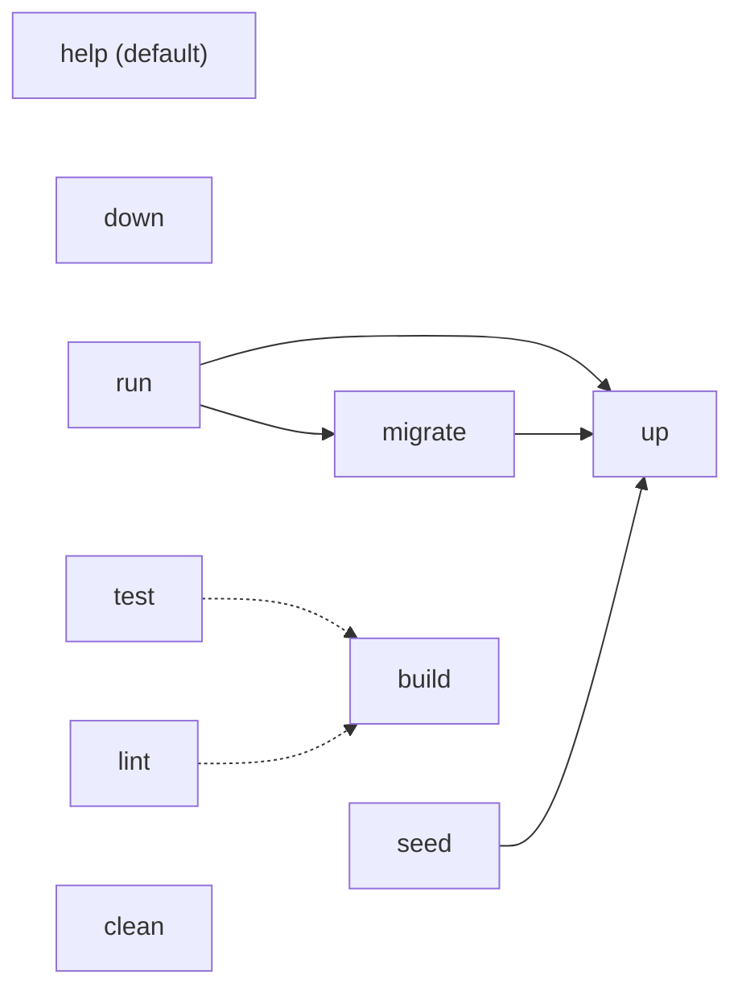

# CookSense Backend — Makefile Targets Specification

> **Spec-Driven Development (SDD) — Story 02**
>
> **Story:** 02 — Makefile targets wrapping `docker compose`, `modd`, and the Go toolchain
> **Status:** Draft
> **Version:** 1.0.0
> **Authors:** CookSense Engineering
> **License:** Proprietary — CookSense

> [!IMPORTANT]
> **The Contract** — This spec IS the source of truth. Code that contradicts
> the spec is a bug. A spec that contradicts reality must be updated first,
> then the code changed to match.

> [!TIP]
> **RFC-2119 Language**
> - **"shall" / "must"** = mandatory requirement (a verification check **must** confirm it)
> - **"should"** = strong recommendation (deviation needs justification)
> - **"may"** = optional

---

## Table of Contents

0. [AI Steering Preamble](#0-ai-steering-preamble)
1. [Introduction](#1-introduction)
2. [Goals & Non-Goals](#2-goals--non-goals)
3. [System Context & Dependencies](#3-system-context--dependencies)
4. [Architecture Overview](#4-architecture-overview)
5. [Artifact Specifications](#5-artifact-specifications)
6. [Configuration Specification](#6-configuration-specification)
7. [Build, Tooling & Quality Specification](#7-build-tooling--quality-specification)
8. [Testing & Verification Specification](#8-testing--verification-specification)
9. [Documentation Specification](#9-documentation-specification)
10. [Appendix A — Specification Checklist](#appendix-a--specification-checklist)
11. [Appendix B — Implementation Task Decomposition](#appendix-b--implementation-task-decomposition)

---

## 0. AI Steering Preamble

### 0.1 AI Persona & Quality Bar

You are a **Staff Software Engineer** implementing this specification. The artefacts produced shall:

- Be **production-grade** — no TODOs, no placeholder logic except where this spec explicitly permits it.
- Read like a **well-edited technical book** — concise targets, intent-revealing names, no incantations.
- Demonstrate **mastery of POSIX make and shell idioms** (portable to GNU Make on Linux and macOS).
- Treat every public target as a **published API** — its name, exit code, and side-effects are stable.

### 0.2 Language Conventions (RFC-2119)

| Keyword | Meaning |
|---------|---------|
| **shall** / **must** | Absolute requirement. A verification step **must** confirm compliance. |
| **shall not** / **must not** | Absolute prohibition. |
| **should** | Strong recommendation. Deviation requires written justification. |
| **may** | Truly optional. |

### 0.3 Code Style Mandate (Makefile-specific)

| Rule | Requirement |
|------|-------------|
| **`.PHONY`** | Every non-file target **shall** be declared in a `.PHONY` line. |
| **Target docs** | Every public target **shall** carry a trailing `## <description>` comment that the `help` target parses. |
| **Tabs** | Recipe lines use a leading TAB, not spaces. |
| **Shell** | Recipes assume POSIX `sh`. macOS / Linux only. Windows is out of scope. |
| **Quoting** | Variable expansions used in shell **shall** be quoted: `"$(VAR)"`, never bare `$(VAR)`. |
| **Magic strings** | Hard-coded paths (`bin/`, `cmd/cooksense-server`) are acceptable in `Makefile` — they are part of the project layout fixed by SPEC-BOOT. |
| **Logging** | `make` recipes **shall not** log secrets. `.env` values are forwarded to subprocesses but never echoed. |

### 0.4 Forbidden Anti-Patterns

| Anti-Pattern | Why It's Forbidden |
|--------------|--------------------|
| Recipes longer than 5 lines of inline shell | Move to a script under `scripts/`. |
| Hidden side-effects (network calls, file deletion outside the target's contract) | Targets are advertised by their name; surprises break trust. |
| `make` calling `make` recursively without need | Slows builds and obscures dependency tracking. |
| Silent failure (recipe succeeds when subcommand fails) | Each step **must** propagate non-zero exit codes. |
| Real secret values committed to `.env.example` | Use placeholders only. |

---

## 1. Introduction

This specification covers **Story 02: Makefile targets**. It defines the
top-level `Makefile` that becomes the canonical developer experience for
cooksense-backend, plus the `.env.example` it complements. Together they
let any contributor run `make help`, `make up`, `make build`, `make test`,
`make lint`, and `make run` without memorising `docker compose`,
`go build`, or `modd` invocations.

The `Makefile` wraps existing infrastructure already in the repo:

- [docker-compose.yml](../docker-compose.yml) — Postgres 17 with healthcheck (the only way we run Postgres locally).
- [modd.conf](../modd.conf) — hot-reload daemon configuration.
- The Go toolchain (`go build`, `go test`, `go vet`).

This story does **not** implement the real `migrate` or `seed`
sub-commands; those arrive in Stories 03 (database migrations) and 05
(seed loader). The `Makefile` reserves the target names and the call
shape so the later stories can fill in the runtime behaviour without
renaming targets.

### 1.1 Scope

This document specifies:

- The complete public target list for the `Makefile`.
- The exact behaviour and exit conditions of each target.
- The `.env` include guard and the `CLEAN_VOLUMES` opt-in for `clean`.
- The contents required of `.env.example` (cross-referenced to [docs/architecture/infra.md](../docs/architecture/infra.md)).
- Verification steps the engineer **shall** run before declaring the story Done.

### 1.2 Definitions

| Term | Definition |
|------|-----------|
| **public target** | A target advertised by `make help`. Public targets carry a `## description` comment. |
| **self-documenting Makefile** | A `Makefile` where `help` greps `## description` comments rather than hard-coding the target list. |
| **healthy** | The Postgres container reports the `healthy` state via the existing `docker-compose.yml` healthcheck (`pg_isready`). |
| **placeholder target** | A target whose runtime payload is stubbed in this story and replaced in a later story (here: `migrate`, `seed`). |
| **SPEC-MAKE-NNN** | Requirement identifier for Story 02. NNN is a zero-padded three-digit number. |

---

## 2. Goals & Non-Goals

### 2.1 Goals

| ID | Goal |
|----|------|
| G-1 | Provide a **single `make` entrypoint** for every common dev task so the workflow does not depend on memorising flags. |
| G-2 | Make the `Makefile` **self-documenting** — `make help` is the discovery mechanism, not the README. |
| G-3 | Wait deterministically for **Postgres healthy** before returning from `make up`, so dependent targets (`migrate`, `seed`, `run`) never race the database. |
| G-4 | Lock the **canonical target names** (`up down migrate seed run build test lint clean help`) so Stories 03 and 05 fill in behaviour without renaming. |
| G-5 | Bring **`.env.example`** into sync with the env-var table in `infra.md`, so `cp .env.example .env` is a complete onboarding step. |

### 2.2 Non-Goals

| ID | Non-Goal |
|----|----------|
| NG-1 | This story **does not** implement real `migrate` behaviour — that arrives in Story 03. |
| NG-2 | This story **does not** implement real `seed` behaviour — that arrives in Story 05. |
| NG-3 | This story **does not** add CI workflows. CI is sketched in `infra.md` §"CI / CD" and lives in a future story. |
| NG-4 | This story **does not** target Windows. Linux and macOS are the supported developer OSes. |
| NG-5 | This story **does not** add `golangci-lint` to the dev dependencies — `make lint` runs it only when it happens to be on `PATH`. |

---

## 3. System Context & Dependencies

### 3.1 Runtime Requirements

| Requirement | Specification |
|-------------|--------------|
| **GNU Make** | ≥ 3.81 (the version shipped with macOS); ≥ 4.0 on Linux distributions. |
| **Docker Engine + Compose v2** | `docker compose` (plugin form) is required. `docker-compose` (legacy) is not supported. |
| **Compose plugin** | `docker compose wait` is preferred; the spec includes a `pg_isready` polling-loop fallback for Compose < v2.22 (see SPEC-MAKE-005). |
| **Go** | `1.26.2` (declared in `go.mod` per SPEC-BOOT-017). |
| **`modd`** | Available on `PATH`; install via `go install github.com/cortesi/modd/cmd/modd@latest`. |
| **`golangci-lint`** | Optional. If on `PATH`, `make lint` invokes it; otherwise `make lint` prints a notice and continues. |
| **OS** | Linux, macOS. |

### 3.2 Repository Inputs

The `Makefile` depends only on artefacts already in the repo:

- [docker-compose.yml](../docker-compose.yml) — Postgres 17 service named `postgres` with a `pg_isready` healthcheck and a named volume `postgres_data`.
- [modd.conf](../modd.conf) — watches `**/*.go`, builds, and daemonises the server.
- `go.mod` — provides the module path and Go version.
- `cmd/cooksense-server/` — the binary's main package (per SPEC-BOOT-012).

### 3.3 External Systems & APIs

None. All commands are local. No network calls beyond what `docker compose pull` performs the first time the Postgres image is fetched.

---

## 4. Architecture Overview

### 4.1 Design Patterns Applied

| Pattern | Usage |
|---------|-------|
| **Façade** | The `Makefile` is a thin façade over `docker compose`, `modd`, and the Go toolchain. |
| **Self-documentation** | `help` is generated by parsing `## description` comments, not by maintaining a parallel doc block. |
| **Open–Closed** | Stories 03 and 05 extend `migrate` / `seed` by replacing the subcommand body in `cooksense-server`, never by editing the `Makefile`. |

### 4.2 Target Dependency Graph



Solid edges are explicit `make` prerequisites. Dotted edges are
documentation-only — a developer typically runs `build` before `test` /
`lint`, but the targets are independent so CI can parallelise them.

### 4.3 File Layout

The `Makefile` lives at the repository root. Any logic that would push
the file past **80 lines** **shall** be extracted to a script under
`scripts/`. As of Story 02, no `scripts/` files are required (see SPEC-MAKE-015).

```
.
├── Makefile              # this story
├── .env.example          # this story
├── docker-compose.yml    # existing (do not edit)
├── modd.conf             # existing (do not edit)
└── scripts/              # created on demand only; not required by Story 02
```

---

## 5. Artifact Specifications

### 5.1 The `Makefile` itself

#### SPEC-MAKE-001: `Makefile` exists at repository root

A file named exactly `Makefile` (capital `M`, no extension) **shall**
exist at the repository root. GNU Make **shall** parse it without errors
when invoked as `make help` from a fresh checkout.

#### SPEC-MAKE-002: `help` is the default target

`help` **shall** be the first target declared in the `Makefile`, making
it the default invoked by bare `make`. `make help` **shall**:

1. Exit with status `0`.
2. Print a non-empty list of target names with their `##` description, one
   target per line, sorted by appearance in the file.
3. Be implemented by parsing `^[a-zA-Z_-]+:.*?##` lines (e.g., via `awk`
   or `grep` + `sed`), **not** by hard-coding the target list in a
   separate echo block.

**Design note:** the canonical idiom is

```makefile
help: ## Show this help.
	@awk 'BEGIN {FS = ":.*?## "} /^[a-zA-Z_-]+:.*?## / {printf "  \033[36m%-12s\033[0m %s\n", $$1, $$2}' $(MAKEFILE_LIST)
```

#### SPEC-MAKE-003: Public target list (exhaustive)

The `Makefile` **shall** declare exactly the following public targets,
and **shall not** add any further public target in this story:

| Target | Purpose |
|--------|---------|
| `help` | Print this help. |
| `up` | Start Postgres in the background and wait until healthy. |
| `down` | Stop Postgres; preserve the data volume. |
| `migrate` | Apply database migrations (delegates to `cooksense-server migrate`). |
| `seed` | Load curated YAML data (delegates to `cooksense-server seed`). |
| `run` | Start the server with `modd` hot-reload. |
| `build` | Build `bin/cooksense-server`. |
| `test` | Run `go test ./...`. |
| `lint` | Run `go vet ./...` (and `golangci-lint run` if available). |
| `clean` | Remove build artefacts; volumes preserved unless `CLEAN_VOLUMES=1`. |

Internal targets (e.g., a private `_wait-postgres` helper) **may** exist
but **shall not** carry a `## description` comment, so they are hidden
from `make help`.

---

### 5.2 `up` — start Postgres and wait healthy

#### SPEC-MAKE-004: `up` invokes Compose

`make up` **shall** run `docker compose up -d postgres` (or
`docker compose up -d` when no other services exist). It **shall**
succeed (exit `0`) only after both:

1. The container starts without error, and
2. SPEC-MAKE-005 (healthcheck wait) reports healthy.

#### SPEC-MAKE-005: `up` waits until Postgres is healthy

After starting the container, `make up` **shall** wait for the Postgres
healthcheck (defined in [docker-compose.yml](../docker-compose.yml)) to
report `healthy` before returning. The wait **shall** use
`docker compose wait postgres` as the primary mechanism. If the local
Compose version does not support `wait` (Compose < v2.22), the recipe
**shall** fall back to a polling loop using `pg_isready` (or
`docker compose ps --format json | jq` / `docker inspect` to read the
health state) with:

- A poll interval **should** be ≤ 2 seconds.
- A total timeout **shall** be ≤ 30 seconds.
- On timeout, the recipe **shall** exit non-zero with a message naming
  the container.

**Design note:** the recommended idiom is to attempt `docker compose wait`
first and shell-fall-back on its non-zero exit:

```makefile
up: ## Start Postgres and wait until healthy.
	docker compose up -d postgres
	docker compose wait postgres 2>/dev/null || \
	  (i=0; until docker compose exec -T postgres pg_isready -q; do \
	    i=$$((i+2)); [ $$i -ge 30 ] && echo "postgres not healthy after 30s" && exit 1; \
	    sleep 2; done)
```

The exact shell is at the engineer's discretion provided the timeout and
exit-code contract above is satisfied.

---

### 5.3 `down` — stop Postgres (preserve volume)

#### SPEC-MAKE-006: `down` does not drop the data volume

`make down` **shall** run `docker compose down`. It **shall not** pass
`-v` / `--volumes`, so the `postgres_data` named volume is preserved
across stop/start cycles. The only target permitted to drop the volume
is `clean` under the explicit `CLEAN_VOLUMES=1` opt-in (SPEC-MAKE-011).

---

### 5.4 `build` — produce the server binary

#### SPEC-MAKE-007: `build` produces `bin/cooksense-server`

`make build` **shall** invoke

```
go build -o bin/cooksense-server ./cmd/cooksense-server
```

The `bin/` directory **shall** be created on demand (the recipe **may**
prefix with `mkdir -p bin`). `bin/` is already covered by `.gitignore`
per SPEC-BOOT-016. On success, the file `bin/cooksense-server` (or
`bin/cooksense-server.exe` on Windows host shells, though Windows is out
of scope) **shall** exist and be executable.

---

### 5.5 `run` — hot-reload via `modd`

#### SPEC-MAKE-008: `run` invokes `modd`

`make run` **shall** invoke `modd` from the repository root, which picks
up the existing [modd.conf](../modd.conf). The recipe **shall not**
duplicate the build/daemon logic that already lives in `modd.conf`; it
**shall** simply exec `modd`.

`run` **should** declare `up migrate` as `make` prerequisites so the
database is ready before the server starts. (`migrate` in turn depends on
`up`.) The dependency chain ensures `make run` on a clean machine works
end-to-end.

---

### 5.6 `test` — Go unit tests

#### SPEC-MAKE-009: `test` runs `go test ./...`

`make test` **shall** invoke `go test ./...`. It **shall not** force
coverage reporting in this story — coverage thresholds are introduced in
Story 03 onward (per SPEC-BOOT §8.3). It **shall** propagate the exit
code of `go test`.

---

### 5.7 `lint` — Go vet + optional `golangci-lint`

#### SPEC-MAKE-010: `lint` runs `go vet`, optionally `golangci-lint`

`make lint` **shall**:

1. Run `go vet ./...` and propagate its exit code on failure.
2. Probe `PATH` for `golangci-lint` (e.g., `command -v golangci-lint`).
3. If found, run `golangci-lint run ./...` and propagate its exit code.
4. If not found, print a notice such as
   `golangci-lint not on PATH, skipping (install: https://golangci-lint.run/welcome/install/)`
   and exit `0`.

`lint` **shall not** install `golangci-lint`; that is the developer's
responsibility.

---

### 5.8 `clean` — remove build artefacts

#### SPEC-MAKE-011: `clean` removes `bin/`; volumes opt-in

`make clean` **shall** remove the `bin/` directory (e.g., `rm -rf bin`).
It **shall not** drop the `postgres_data` Docker volume by default.

When invoked with `CLEAN_VOLUMES=1` (i.e., `make clean CLEAN_VOLUMES=1`),
the recipe **shall** additionally run `docker compose down -v`, which
removes the volume. The default invocation **shall** leave the volume
intact even if Postgres is currently running.

**Design note:**

```makefile
clean: ## Remove build artefacts. Set CLEAN_VOLUMES=1 to also drop Postgres data.
	rm -rf bin
ifeq ($(CLEAN_VOLUMES),1)
	docker compose down -v
endif
```

---

### 5.9 `migrate` and `seed` — placeholder wrappers

#### SPEC-MAKE-012: `migrate` and `seed` delegate to `cooksense-server`

Both targets **shall** invoke the binary's eponymous subcommand:

| Target | Recipe |
|--------|--------|
| `migrate` | `go run ./cmd/cooksense-server migrate` |
| `seed`    | `go run ./cmd/cooksense-server seed` |

In Story 02, the subcommand body **may** print a "not implemented"
message and exit `0`; the spec for that printout (and the real behaviour
that replaces it) lives in Stories 03 (`migrate`) and 05 (`seed`). What
Story 02 locks down is the **target name** and the **call shape**:

- The targets **shall** call the binary via `go run`, not via a separate
  script. This guarantees the call shape will continue to work after
  Story 03 / 05 introduce real subcommand handlers.
- Each target **shall** declare `up` as a prerequisite so the database
  is ready by the time the real implementation lands. (`migrate` is
  also a prerequisite of `run`; see SPEC-MAKE-008.)

---

### 5.10 `.PHONY` declarations

#### SPEC-MAKE-013: Every non-file target is `.PHONY`

The `Makefile` **shall** declare every public target listed in
SPEC-MAKE-003 as `.PHONY`. A single consolidated declaration near the
top of the file is preferred over per-target `.PHONY` lines. Internal
helper targets (if any) **shall** also be `.PHONY` unless they
genuinely produce a file matching the target name.

---

### 5.11 `.env` include guard

#### SPEC-MAKE-014: `.env` is included if present, ignored if absent

The `Makefile` **shall** forward variables from a project-root `.env`
file to recipe subprocesses when the file exists, and **shall** behave
identically (no error, no warning to stderr) when it is absent.

The canonical idiom is the dash-prefixed include:

```makefile
-include .env
export
```

The dash before `include` suppresses the "file not found" error. The
`export` directive forwards every variable Make has read to recipe
subprocesses.

Variables defined on the `make` command line (`make up POSTGRES_PORT=5433`)
**shall** override values from `.env`.

---

### 5.12 File-size constraint

#### SPEC-MAKE-015: `Makefile` size

The `Makefile` **should** stay at or under 80 lines (excluding blank
lines and `##` comment lines). Logic that would exceed this budget
**shall** be extracted to a script under `scripts/` and invoked from the
recipe. Story 02 introduces no scripts; if T-09 verification reveals a
recipe needing > 5 inline shell lines, the engineer **shall** create
`scripts/<name>.sh` rather than inline it.

---

### 5.13 `.env.example`

#### SPEC-MAKE-016: `.env.example` mirrors `infra.md`

A file named `.env.example` **shall** exist at the repository root and
**shall** list every variable from the table in
[docs/architecture/infra.md](../docs/architecture/infra.md) §"Environment variables":

| Var |
|-----|
| `APP_PORT` |
| `LOG_LEVEL` |
| `LOG_FORMAT` |
| `DATABASE_URL` |
| `POSTGRES_USER` |
| `POSTGRES_PASSWORD` |
| `POSTGRES_DB` |
| `POSTGRES_PORT` |
| `FIREBASE_PROJECT_ID` |
| `GOOGLE_APPLICATION_CREDENTIALS` |

Each variable **shall** appear on its own line in `KEY=value` form.
Optional variables **shall** be set to the default listed in
`infra.md`. Required variables **shall** be set to a placeholder
(`changeme`, `path/to/firebase-admin.json`, or a syntactically valid
`postgres://` URL pointing at the Compose defaults) plus a trailing
`# required` comment so the developer knows to fill them in.

The file **should** group variables into the same sections as
`infra.md` (server, database, Firebase) using `# --- Section ---`
header comments.

#### SPEC-MAKE-017: `.env.example` contains no real secrets

`.env.example` **shall not** contain any production credential, API
key, real Firebase project ID, or real database password. Only
placeholder values are permitted. CI **shall** reject any commit that
introduces a secret-shaped value (e.g., a Firebase service-account JSON
blob) into `.env.example`.

---

## 6. Configuration Specification

### 6.1 Configuration surface

Story 02 introduces no application configuration. The `Makefile`
exposes two configuration knobs to the developer:

| Variable | Source | Effect |
|----------|--------|--------|
| `CLEAN_VOLUMES` | command line (`make clean CLEAN_VOLUMES=1`) | Causes `clean` to drop the Postgres data volume (SPEC-MAKE-011). |
| Anything in `.env` | file inclusion (SPEC-MAKE-014) | Forwarded to subprocesses (e.g., `POSTGRES_PORT` consumed by `docker compose`). |

### 6.2 Validation

The `Makefile` **shall not** validate `.env` contents. Validation of
required environment variables (e.g., `DATABASE_URL`,
`FIREBASE_PROJECT_ID`) is the responsibility of the
`cooksense-server` binary at startup, per Story 03's spec.

---

## 7. Build, Tooling & Quality Specification

### 7.1 Verification commands

| Requirement | Command | Expected outcome |
|-------------|---------|-----------------|
| **SPEC-MAKE-018** | `make help` | Exits `0`. Stdout is non-empty. Every target from SPEC-MAKE-003 appears with its `##` description. |
| **SPEC-MAKE-019** | `make build` | Exits `0`. File `bin/cooksense-server` exists and is executable. |
| **SPEC-MAKE-020** | `make lint` | Exits `0` on a clean tree, regardless of whether `golangci-lint` is on `PATH`. |

### 7.2 Toolchain assumptions

| Setting | Value |
|---------|-------|
| **GNU Make** | The repo targets GNU Make. BSD Make is not supported (the `ifeq` syntax in SPEC-MAKE-011 is GNU-specific). |
| **Compose plugin** | `docker compose` (v2). Legacy `docker-compose` is not invoked. |
| **Shell** | POSIX `sh`. The `Makefile` **shall not** require `bash` unless GNU Make's default `SHELL` is left unchanged. |

### 7.3 Linting

There is no lint step for the `Makefile` itself in Story 02.
`checkmake` or `make-lint` **may** be added in a future story; this
spec does not require it.

---

## 8. Testing & Verification Specification

### 8.1 Verification Philosophy

The `Makefile` is infrastructure code. Story 02 does not introduce
Go unit tests; instead, every `SPEC-MAKE-NNN` is verified by a
documented manual or scriptable command run against a clean checkout.

### 8.2 Verification Matrix

Every requirement in §5 maps to at least one verification check below.

| SPEC-ID | Verification |
|---------|--------------|
| SPEC-MAKE-001 | `test -f Makefile && make -n help` exits `0`. |
| SPEC-MAKE-002 | `make` (no args) prints the help block; first target line in the file is `help:`. |
| SPEC-MAKE-003 | `make help` lists exactly the 10 target names; no extras. |
| SPEC-MAKE-004 | After `make up`, `docker compose ps postgres` shows `running`. |
| SPEC-MAKE-005 | After `make up`, `docker inspect --format '{{.State.Health.Status}}' cooksense-postgres` returns `healthy` before the recipe exits. Re-run on a Compose-pre-2.22 host to confirm fallback path. |
| SPEC-MAKE-006 | After `make up && make down`, `docker volume ls` still lists `postgres_data`. |
| SPEC-MAKE-007 | After `make build`, `file bin/cooksense-server` reports an ELF / Mach-O executable. |
| SPEC-MAKE-008 | `make -n run` (dry-run) shows `modd` invocation; with `up` and `migrate` as prerequisites. |
| SPEC-MAKE-009 | `make test` exit code matches `go test ./...` exit code. |
| SPEC-MAKE-010 | `PATH= make lint` (no `golangci-lint`) exits `0` and prints the notice. With `golangci-lint` installed and a deliberate violation, `make lint` exits non-zero. |
| SPEC-MAKE-011 | `make clean` leaves `postgres_data` volume present. `make clean CLEAN_VOLUMES=1` removes it. |
| SPEC-MAKE-012 | `make -n migrate` shows `go run ./cmd/cooksense-server migrate`; same for `seed`. Running the targets exits `0` (placeholder). |
| SPEC-MAKE-013 | `grep -E '^\.PHONY:' Makefile` covers every target from SPEC-MAKE-003. |
| SPEC-MAKE-014 | With no `.env` file: `make help` succeeds without warnings. With `.env` containing `POSTGRES_PORT=5433`: `make -n up` shows the value forwarded. |
| SPEC-MAKE-015 | `wc -l Makefile` reports ≤ 80 non-blank, non-comment lines (or the deviation is documented inline). |
| SPEC-MAKE-016 | Diff of `.env.example` against the variable list in `infra.md` is empty. |
| SPEC-MAKE-017 | `git grep -E '(BEGIN PRIVATE KEY|AIza[0-9A-Za-z_-]{35}|sk-[A-Za-z0-9]{20,})' .env.example` returns no matches. |
| SPEC-MAKE-018 | See §7.1. |
| SPEC-MAKE-019 | See §7.1. |
| SPEC-MAKE-020 | See §7.1. |

### 8.3 Naming convention (for future Go tests)

Future Go tests touching this area **shall** follow the project-wide
pattern `Test{What}_{Condition}_{ExpectedOutcome}` (per SPEC-BOOT §8.2).

### 8.4 Coverage

Story 02 introduces no Go code, so the 80% / 90% coverage thresholds
(SPEC-BOOT §8.3) do not apply to this story.

---

## 9. Documentation Specification

### 9.1 In-file documentation

Every public target **shall** carry a trailing `## <description>`
comment used by the `help` recipe (SPEC-MAKE-002). The description
**shall** be a single sentence in the imperative mood (e.g.,
"Start Postgres and wait until healthy.").

### 9.2 README

Story 02 **shall not** modify `README.md`. The README's "Quickstart"
section is rewritten in Story 12, at which point it links to
`make help` rather than duplicating the target list.

### 9.3 Architecture doc

[docs/architecture/infra.md](../docs/architecture/infra.md) already
contains the canonical target table (§"Make targets"). This spec is the
authoritative source for the *behaviour* of those targets; `infra.md`
**should** be updated to link to this spec rather than duplicating
detail. That update is in scope for the engineer implementing T-09.

---

## Appendix A — Specification Checklist

- [x] **Section 0** — AI Preamble adapted for Makefile + shell context; forbidden anti-patterns enumerated.
- [x] **Section 1** — Introduction names Story 02; glossary covers public target, self-documenting Makefile, healthy, placeholder target.
- [x] **Section 2** — Five goals (G-1..G-5), all observable via the verification matrix; non-goals fence off CI, Windows, and Stories 03/05 behaviour.
- [x] **Section 3** — Runtime requirements (GNU Make, Compose v2, Go 1.26.2, modd, optional golangci-lint) listed with versions; repo inputs cross-referenced.
- [x] **Section 4** — Façade + self-documentation patterns mapped to the Makefile; target dependency graph drawn; file layout fixed.
- [x] **Section 5** — Every story AC mapped to ≥ 1 SPEC-MAKE-NNN (001–017). Each requirement uses RFC-2119 keywords. Design notes provided for non-trivial recipes.
- [x] **Section 6** — Configuration knobs (`CLEAN_VOLUMES`, `.env` forwarding) documented; validation deferred to Story 03.
- [x] **Section 7** — Verification commands (SPEC-MAKE-018..020) defined; toolchain assumptions explicit.
- [x] **Section 8** — Verification matrix has a row for every SPEC-MAKE-NNN.
- [x] **Section 9** — `##` comment standard documented; README update deferred to Story 12.
- [x] **Appendix B** — Tasks T-01..T-09 each cite the SPEC-MAKE-NNN they implement and the upstream/downstream dependencies.

---

## Appendix B — Implementation Task Decomposition

Ordered list of atomic tasks. Each task **shall** be implemented and
verified (per §8.2) before moving to the next. The story is Done when
every row's verification passes.

| Task | SPEC-IDs | Description | Dependencies |
|------|----------|-------------|--------------|
| T-01 | SPEC-MAKE-001, 002, 003, 013 | Create `Makefile` skeleton: `.PHONY` line listing all 10 targets; `help` as default target with awk-based `##` parsing; empty recipe stubs for the other 9 | SPEC-BOOT (Story 01) |
| T-02 | SPEC-MAKE-004, 005, 006 | Implement `up` (with `docker compose wait` + `pg_isready` fallback, ≤30s timeout) and `down` (no `-v`) | T-01 |
| T-03 | SPEC-MAKE-007, 008, 009 | Implement `build` (writes `bin/cooksense-server`), `run` (execs `modd`, declares `up migrate` prereqs), `test` (`go test ./...`) | T-01 |
| T-04 | SPEC-MAKE-010 | Implement `lint`: `go vet` always; `golangci-lint run` if on `PATH`, else notice + exit 0 | T-01 |
| T-05 | SPEC-MAKE-011 | Implement `clean`: `rm -rf bin`; `ifeq ($(CLEAN_VOLUMES),1)` branch invokes `docker compose down -v` | T-01 |
| T-06 | SPEC-MAKE-012 | Implement `migrate` and `seed` as `go run ./cmd/cooksense-server <name>` wrappers; `up` prerequisite on both | T-01 |
| T-07 | SPEC-MAKE-014, 015 | Add `-include .env` + `export` block; verify line count ≤ 80 (excluding blanks and `##` lines) | T-01..T-06 |
| T-08 | SPEC-MAKE-016, 017 | Rewrite `.env.example` to mirror `infra.md` env-var table; placeholder values only; sectioned by feature | None |
| T-09 | SPEC-MAKE-018, 019, 020, plus full §8.2 matrix | Run every verification in the matrix on a clean machine; update `infra.md` to link to this spec; mark story Done | T-01..T-08 |

---

*End of SPEC-MAKE — Story 02 Makefile Targets — v1.0.0*
