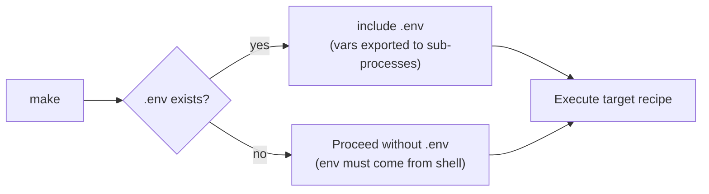

# SPEC-MAKE-05 — Architecture Overview

> Part of [SPEC-MAKE](SPEC-MAKE-00-index.md) — Story 02: Makefile Targets

---

## 4. Architecture Overview

### 4.1 Makefile Structure

```
Makefile
├── Guard section        — include .env (if present)
├── Variables            — BINARY, CMD_DIR, BIN_DIR
├── .PHONY declaration   — all 10 public targets
├── help (default)       — self-documentation
├── up / down            — docker compose wrappers
├── migrate / seed       — go run subcommands
├── build                — go build
├── run                  — modd
├── test                 — go test
├── lint                 — go vet + optional golangci-lint
└── clean                — remove bin/, optional volume drop
```

### 4.2 `.env` Loading Strategy



The conditional include **shall** use:

```makefile
-include .env
```

The leading `-` ensures `make` does not fail when `.env` is absent.

### 4.3 Target Dependency Graph

```
help        ← (no deps)
up          ← (no deps)
down        ← (no deps)
migrate     ← up
seed        ← up migrate
run         ← up migrate
build       ← (no deps)
test        ← (no deps)
lint        ← (no deps)
clean       ← (no deps)
```

> **Note**: `run` declares `up migrate` as prerequisites so that `make run` on a cold machine starts Postgres and applies migrations before launching `modd`.

### 4.4 Line Budget

The `Makefile` **shall** stay at or below **80 lines** (comments, blank lines, and recipes combined). Any logic that would push past this budget **shall** be extracted to a script under `scripts/`.
